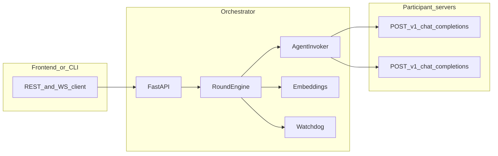

# DistLM

<<<<<<< Updated upstream
<<<<<<< Updated upstream
<<<<<<< Updated upstream
<<<<<<< Updated upstream
<<<<<<< Updated upstream
**DistLM** is a **distributed LLM swarm** experiment: a central **orchestrator** runs multi-round jobs, calls each participant’s **OpenAI-compatible chat endpoint**, scores answers with **embeddings + kNN context**, applies a **watchdog**, and computes **numeric settlement**. Participants keep their own models; the orchestrator does not host weights.

| Document | Purpose |
|----------|---------|
| [orcplan.md](orcplan.md) | Orchestrator contract, I/O tables, round engine, payout math |
| [agentplan.md](agentplan.md) | Agent HTTP contract (`POST /v1/chat/completions`), headers, sandbox expectations |
| [howtouseagent.md](howtouseagent.md) | Optional Python helpers under `agent_backend/` |

---

## Repository layout

```
DistLM/
├── orchestrator/          # FastAPI coordinator (jobs, invoker, rounds, WS)
│   ├── main.py            # HTTP + WebSocket routes
│   ├── engine.py          # Round loop, kNN context, impact
│   ├── invoker.py         # Sandboxed outbound POST …/v1/chat/completions
│   ├── embeddings.py      # MiniLM (sentence-transformers) or hash vectors
│   ├── watchdog.py        # Short/duplicate/error + residual cos(R−P, P) gate
│   ├── payout.py          # Floor + impact-weighted split
│   ├── store.py           # In-memory job store + WS fan-out
│   └── models.py          # Pydantic request/response models
├── agent_backend/
│   ├── agent_invoke.py    # Library: build DistLM-shaped requests, call upstream LLM
│   └── test_invoke/       # FastAPI tester UI + POST /invoke (local dev)
├── scripts/
│   └── run_distlm_sim.py  # CLI: echo agent subprocess + orchestrator + printed audit
├── tests/                 # Pytest (unit + integration)
├── tests/fixtures/
│   └── echo_agent.py      # Minimal OpenAI-compatible agent for e2e / sim
├── # Agents run Ollama (qwen2.5:0.5b) on their machines
├── pyproject.toml
├── pytest.ini
├── orcplan.md
└── agentplan.md
```

---

## Requirements

=======
FastAPI service that implements the **orchestrator** contract in [`orcplan.md`](orcplan.md): job lifecycle, outbound OpenAI-shaped calls to registered agent URLs, multi-round orchestration with **kNN**-driven context updates, **watchdog** pruning, **impact** metrics, **payout** math, and a **WebSocket** progress feed.

Remote agents should follow [`agentplan.md`](agentplan.md). Optional Python helpers for agents live under `agent_backend/` (see [`howtouseagent.md`](howtouseagent.md)).

## Requirements

>>>>>>> Stashed changes
=======
FastAPI service that implements the **orchestrator** contract in [`orcplan.md`](orcplan.md): job lifecycle, outbound OpenAI-shaped calls to registered agent URLs, multi-round orchestration with **kNN**-driven context updates, **watchdog** pruning, **impact** metrics, **payout** math, and a **WebSocket** progress feed.

Remote agents should follow [`agentplan.md`](agentplan.md). Optional Python helpers for agents live under `agent_backend/` (see [`howtouseagent.md`](howtouseagent.md)).

## Requirements

>>>>>>> Stashed changes
=======
FastAPI service that implements the **orchestrator** contract in [`orcplan.md`](orcplan.md): job lifecycle, outbound OpenAI-shaped calls to registered agent URLs, multi-round orchestration with **kNN**-driven context updates, **watchdog** pruning, **impact** metrics, **payout** math, and a **WebSocket** progress feed.

Remote agents should follow [`agentplan.md`](agentplan.md). Optional Python helpers for agents live under `agent_backend/` (see [`howtouseagent.md`](howtouseagent.md)).

## Requirements

>>>>>>> Stashed changes
=======
FastAPI service that implements the **orchestrator** contract in [`orcplan.md`](orcplan.md): job lifecycle, outbound OpenAI-shaped calls to registered agent URLs, multi-round orchestration with **kNN**-driven context updates, **watchdog** pruning, **impact** metrics, **payout** math, and a **WebSocket** progress feed.

Remote agents should follow [`agentplan.md`](agentplan.md). Optional Python helpers for agents live under `agent_backend/` (see [`howtouseagent.md`](howtouseagent.md)).

## Requirements

>>>>>>> Stashed changes
=======
FastAPI service that implements the **orchestrator** contract in [`orcplan.md`](orcplan.md): job lifecycle, outbound OpenAI-shaped calls to registered agent URLs, multi-round orchestration with **kNN**-driven context updates, **watchdog** pruning, **impact** metrics, **payout** math, and a **WebSocket** progress feed.

Remote agents should follow [`agentplan.md`](agentplan.md). Optional Python helpers for agents live under `agent_backend/` (see [`howtouseagent.md`](howtouseagent.md)).

## Requirements

>>>>>>> Stashed changes
- **Python 3.11+** (see `pyproject.toml`).
- **Default embedding backend** is **MiniLM** via `sentence-transformers` (first run may download model weights; pulls heavy deps such as PyTorch).
- For **fast CI / tests**, tests default to **`ORC_EMBEDDING_BACKEND=hash`** (see `tests/conftest.py`).

## Install

From the repo root:

```bash
python -m pip install -e .
```

Development dependencies (pytest):
<<<<<<< Updated upstream
<<<<<<< Updated upstream
<<<<<<< Updated upstream
<<<<<<< Updated upstream
<<<<<<< Updated upstream
=======
=======
```bash
python -m pip install -e ".[dev]"
```

## Run the server

On Windows, `uvicorn` may be installed but **not on PATH** (user-site `Scripts`). Prefer the module form:

```bash
python -m uvicorn orchestrator.main:app --host 0.0.0.0 --port 8000 --reload
```

Listens on all interfaces so other machines on the LAN can reach it. On this machine use `http://127.0.0.1:8000`; from another device use `http://<this-host-LAN-IP>:8000`. Health check: `GET /health` → `{"status":"ok"}`.

## Frontend integration

The Next.js app in `frontend/` now supports two modes:

- **Mock mode** (default fallback): no backend URL configured; UI uses local mock data/timers.
- **Backend mode**: launch flow creates jobs via orchestrator, subscribes to `WS /ws/jobs/{job_id}`, and hydrates feed/results from live events plus operator snapshots.

### Frontend env vars

Create `frontend/.env.local`:

```bash
NEXT_PUBLIC_ORCHESTRATOR_BASE_URL=http://127.0.0.1:8000
NEXT_PUBLIC_AGENT_BASE_URL=http://127.0.0.1:8010
# Optional: comma-separated fleet endpoints; overrides single base URL when set.
# NEXT_PUBLIC_AGENT_BASE_URLS=http://127.0.0.1:8010,http://127.0.0.1:8011
# Optional: only if ORC_OPERATOR_TOKEN is enabled on backend.
# NEXT_PUBLIC_ORCHESTRATOR_OPERATOR_TOKEN=your_token_here
```

Notes:

- `NEXT_PUBLIC_ORCHESTRATOR_BASE_URL` toggles **backend mode**.
- On another device on the same LAN, set it to `http://<signaling-host-LAN-IP>:8000` (the orchestrator must be started with `--host 0.0.0.0`).
- `NEXT_PUBLIC_AGENT_BASE_URL` (or `NEXT_PUBLIC_AGENT_BASE_URLS`) is required in backend mode for slot registration.
- If backend mode is disabled or misconfigured, the frontend remains usable in mock mode.

### Frontend run

Terminal 1 (repo root, mock agent):

```bash
python -m uvicorn tests.fixtures.echo_agent:app --host 127.0.0.1 --port 8010
```

Terminal 2:

```bash
cd frontend
npm install
npm run dev
```

With both services running:

1. Open `http://localhost:3000`.
2. Launch a simulation from `/`.
3. Frontend creates and registers a backend job, then navigates to `/app?job_id=...`.
4. `/app`, `/app/feed`, and `/app/results` consume real runtime data (with polling fallback).

## Multi-server network

You can run the **orchestrator** on one machine and **agents** on others. The orchestrator calls each registered `completion_base_url` over HTTP; agents can run local models behind an OpenAI-compatible `POST /v1/chat/completions` endpoint.

### Who talks to whom

| Component | Typical host | Reaches |
|-----------|--------------|---------|
| **Browser** (Next.js UI) | Laptop or shared web host | **Orchestrator** (`NEXT_PUBLIC_ORCHESTRATOR_BASE_URL`) via HTTP + WebSocket |
| **Orchestrator** | One “control” server | **Each agent** at the URL stored for that slot (`POST {base}/v1/chat/completions`) |
| **Agent** (echo or model wrapper) | One or many servers | Local model / process; accepts HTTP from the **orchestrator** |

**Important:** `completion_base_url` values must be reachable **from the orchestrator process**, not only from your browser. The browser sends those URL strings in `POST /jobs/{id}/agents`, but **outbound** completion calls are made by the orchestrator.

### Example topology

| Role | Example IP | Service |
|------|------------|---------|
| **Server O** (control) | `10.0.0.1` | Orchestrator `:8000`, optional Next `:3000` |
| **Server A** | `10.0.0.10` | Echo or model agent `:8010` |
| **Server B** | `10.0.0.11` | Echo or model agent `:8010` |

Replace IPs with your LAN/VPC addresses or DNS names.

### 1. Install on every Python host

From the repo root on each machine:

```bash
cd /path/to/DistLM
python -m pip install -e .
```

### 2. Agent servers - bind on the network interface

On **each agent machine**, run the bundled echo agent (or your own OpenAI-compatible app). Use **`0.0.0.0`** so the orchestrator can connect over the LAN; **`127.0.0.1` alone** would only accept local connections.

**Server A:**

```bash
cd /path/to/DistLM
python -m uvicorn tests.fixtures.echo_agent:app --host 0.0.0.0 --port 8010
```

**Server B** (same command; if two agents share one OS, use a different `--port` on the second process).

**Sanity check from Server O** (or any host that should behave like the orchestrator):

```bash
curl -s http://10.0.0.10:8010/health
curl -s http://10.0.0.11:8010/health
```

Expect JSON including `"status":"ok"`. If this fails, open **firewall / security group** rules: **TCP from O to each agent port** (e.g. `8010`).

### 3. Orchestrator - listen on the network

**On Server O:**

```bash
cd /path/to/DistLM
python -m uvicorn orchestrator.main:app --host 0.0.0.0 --port 8000
```

(Add `--reload` only for local development.)

**Orchestrator environment (multi-server):**

- **`ORC_LAN_MODE`** - Default `1`: allow CORS from typical **private IPv4** UI origins (`192.168.*`, `10.*`, `172.16-31.*`, any port) so phones/laptops on the same Wi‑Fi can hit the API. Set `0` if the orchestrator is internet-exposed and you want an explicit origin list only.

- **`ORC_CORS_ORIGINS`** - Optional comma-separated **exact** origins for hostnames or non-private URLs. When unset, `localhost` / `127.0.0.1` on port 3000 are still allowed. Example adding explicit entries:

  ```bash
  # Windows (cmd) - set before starting uvicorn
  set ORC_CORS_ORIGINS=http://10.0.0.1:3000,http://localhost:3000

  # bash
  export ORC_CORS_ORIGINS=http://10.0.0.1:3000,http://localhost:3000
  ```

- **`ORC_ALLOWED_HOSTS`** - If set (comma-separated hostnames or IP strings), the invoker **only** allows those hosts in agent URLs. Leave unset for permissive LAN testing; set in production to pin agents, e.g. `10.0.0.10,10.0.0.11,my-agent.internal`.

- **`ORC_ALLOW_LOCALHOST=0`** - Optional hardening to forbid `localhost` / `127.0.0.1` in agent URLs.

Restart the orchestrator after changing these variables.

**Check:**

```bash
curl -s http://10.0.0.1:8000/health
```

### 4. Frontend - env vars for several agent bases

In **`frontend/.env.local`** (restart `npm run dev` after edits):

```bash
NEXT_PUBLIC_ORCHESTRATOR_BASE_URL=http://10.0.0.1:8000
NEXT_PUBLIC_AGENT_BASE_URLS=http://10.0.0.10:8010,http://10.0.0.11:8010
```

- **`NEXT_PUBLIC_ORCHESTRATOR_BASE_URL`** - Must be reachable **from the browser** (use the hostname/IP the user’s machine can open).
- **`NEXT_PUBLIC_AGENT_BASE_URLS`** - Comma-separated list **without spaces** (each segment is trimmed). The launch flow assigns slots in **round-robin** order: `slot-001` → first URL, `slot-002` → second, `slot-003` → first again, … (`frontend/src/components/simulation-chat.tsx`).

If the UI runs on Server O but you browse from a laptop, both URLs above must still be valid: the **orchestrator** URL for the laptop’s browser, and the **agent** URLs for the **orchestrator**’s outbound HTTP.

**Run the UI** (on O or locally):

```bash
cd frontend
npm install
npm run dev
```

To accept remote browsers on the dev server:

```bash
npm run dev -- --hostname 0.0.0.0 --port 3000
```

### 5. UI - launch a job (same as single-host)

1. Open the app (e.g. `http://10.0.0.1:3000` or your published URL).
2. **Click** the main prompt textarea and **type** the simulation prompt.
3. Adjust **Agents**, **Rounds**, and **Bounty** with the sliders.
4. **Click** **Launch Simulation** (or press **Enter** without **Shift** in the textarea).

The client **`POST`s `/jobs`**, then **`POST`s `/jobs/{job_id}/agents`** with one `completion_base_url` per slot, then navigates to `/app?job_id=...`. Use the top nav **NETWORK**, **FEED**, and **RESULTS** as needed; when a `job_id` exists, links keep it in the query string.

### 6. Same job via HTTP only (debugging)

**Create a job** (Windows `cmd` - use `^` for line continuation; on bash use `\`):

```bash
curl -s -X POST http://10.0.0.1:8000/jobs -H "Content-Type: application/json" -d "{\"context\":\"demo\",\"prompt\":\"Hello multi-server\",\"agent_count\":4,\"rounds\":2,\"payout\":0.1}"
```

Copy `job_id` from the JSON response, then **register slots** (counts and IDs must match `agent_count`):

```bash
curl -s -X POST http://10.0.0.1:8000/jobs/JOB_ID_HERE/agents -H "Content-Type: application/json" -d "{\"slots\":{\"slot-001\":{\"completion_base_url\":\"http://10.0.0.10:8010\"},\"slot-002\":{\"completion_base_url\":\"http://10.0.0.11:8010\"},\"slot-003\":{\"completion_base_url\":\"http://10.0.0.10:8010\"},\"slot-004\":{\"completion_base_url\":\"http://10.0.0.11:8010\"}}}"
```

Replace `JOB_ID_HERE` with the real id.

### 7. Firewalls and proxies

| Direction | Port | Purpose |
|-----------|------|---------|
| Browser → orchestrator | `8000` (example) | REST + **WebSocket** `/ws/jobs/{id}` |
| Browser → Next | `3000` (example) | UI |
| Orchestrator → each agent | agent port (e.g. `8010`) | `POST .../v1/chat/completions` |

Corporate HTTP proxies must allow **WebSockets** to the orchestrator origin if you use the live UI.

### 8. Production agents instead of echo

Replace `tests.fixtures.echo_agent` with any service that implements **`POST /v1/chat/completions`** compatible with the invoker (see **Orchestrator → agent (invoker)** later in this README). Register each machine’s **origin** only (no `/v1/...` suffix); optionally set `bearer_token` per slot in the registration API when you move beyond the default frontend payload.

### Multi-server checklist

| Step | Command / setting |
|------|-------------------|
| Agents | `python -m uvicorn tests.fixtures.echo_agent:app --host 0.0.0.0 --port 8010` on each agent host |
| Orchestrator | `python -m uvicorn orchestrator.main:app --host 0.0.0.0 --port 8000` (add `--reload` locally); CORS defaults include **`ORC_LAN_MODE=1`** for private LAN UI origins |
| Frontend | `NEXT_PUBLIC_ORCHESTRATOR_BASE_URL`, `NEXT_PUBLIC_AGENT_BASE_URLS` in `frontend/.env.local`; restart `npm run dev` |
| Verify | `curl` agent `/health` from O; `curl` orchestrator `/health`; launch from `/` in the browser |

## How a job runs

1. **`POST /jobs`** - Creates a job (`pending`). Body fields match the plan: `context`, `prompt`, `agent_count`, `rounds`, `payout`, optional `embedding_model_version`.
2. **`POST /jobs/{job_id}/agents`** - Register **exactly** `agent_count` slots (`slots` map). Each slot has `completion_base_url` (base only; the invoker appends `/v1/chat/completions`) and optional `bearer_token`, `external_participant_id` (stored for future payout aggregation; settlement is **per slot** today).
3. When the **last** required slot is registered and the job is still `pending`, the **round engine** starts asynchronously (`running` → rounds → `completed` or `failed`).
4. **`GET /jobs/{job_id}`** - Public status; when terminal, `settlement_preview` may be present.
5. **`GET /jobs/{job_id}/operator`** - Full audit (rounds, completions, embeddings metadata, edges, settlement). Optionally gated by `ORC_OPERATOR_TOKEN` + header `X-Operator-Token`.
6. **`WS /ws/jobs/{job_id}`** - Subscribe **before** or after registration; events are queued per subscriber.

**Storage:** in-memory only (`orchestrator/store.py`); restarting the process loses jobs.

## HTTP API (summary)

| Method | Path | Notes |
|--------|------|--------|
| `GET` | `/health` | Liveness. |
| `POST` | `/jobs` | Create job → `{ "job_id": "..." }`. |
| `POST` | `/jobs/{job_id}/agents` | `{ "slots": { "<id>": { "completion_base_url": "https://..." }, ... } }` → `{ "ok": true, "registered_slots": [...] }`. |
| `GET` | `/jobs/{job_id}` | Public job view (`JobPublicView`). |
| `GET` | `/jobs/{job_id}/operator` | Audit JSON; optional `X-Operator-Token` if `ORC_OPERATOR_TOKEN` is set. |
| `WS` | `/ws/jobs/{job_id}` | JSON messages: `type` plus fields below. |

## Orchestrator → agent (invoker)

For each active (non-pruned) slot each round, the service calls:

- **`POST {completion_base_url}/v1/chat/completions`**
- **Headers:** `Content-Type`, optional `Authorization: Bearer …`, `X-DistLM-Job-Id`, `X-DistLM-Slot-Id`, `X-DistLM-Round` (1-based round index as string).
- **Body:** OpenAI-style chat completion with `messages`: **system** (rotating persona + short policy) then **user** with labeled sections **`### Context`** and **`### Prompt`** (same stable order as `orcplan.md`). Optional **`### Data`** from the plan is **not** emitted yet.

Responses must supply completion text at **`choices[0].message.content`** (non-2xx / timeout → failed completion for that slot).

**SSRF mitigations** (`orchestrator/invoker.py`): `http`/`https` only; blocks cloud metadata IP; optional host **allowlist**; localhost allowed by default for local dev (`ORC_ALLOW_LOCALHOST=0` to block).

## Round engine (behavior)

Implemented in `orchestrator/engine.py`:

- **Per round:** parallel invocations for all non-pruned slots → **watchdog** on each reply (with batch embeddings for prompt vs response) → embed surviving answers → **nearest / furthest** neighbor in embedding space per slot → **impact** (`C_i`, `F_i`) on other slots → build next round **`### Context`** (first round: original context + model label; later rounds: excerpts from previous round’s nearest/furthest neighbors).
- **Personas:** small catalog; index from `hash(slot_id, round, job_id)`.
- **WebSocket events** (envelope shape `{ "type", ... }`): `round_started`, `agent_line` (per slot snippet + prune status), `edge` (`nearest` / `furthest`), `job_done` (includes settlement preview in payload), `job_failed`. Clients should ignore unknown `type` values.

## Embeddings (`orchestrator/embeddings.py`)

| `ORC_EMBEDDING_BACKEND` | Behavior |
|---------------------------|----------|
| `minilm` (default) | `sentence-transformers` + `ORC_MINILM_MODEL` (default `sentence-transformers/all-MiniLM-L6-v2`), L2-normalized vectors, batched encode. |
| `hash` | Deterministic hashed vectors; no model download; used in tests by default. |

kNN and watchdog share the **same** backend and model for comparable geometry.

## Watchdog (`orchestrator/watchdog.py`)

Marks each completion **`valid`**, **`suspect`**, or **`pruned`** (streak-based escalation to prune):

- HTTP / missing content errors
- Too-short text, duplicate text in the same round
- Substring **refusal-like** heuristics → note `possible_refusal` (does not alone force prune unless combined with “bad” streak rules)
- **Residual vs prompt:** embed prompt and response; if `cos_sim(R − P, P) > ORC_WATCHDOG_RESIDUAL_PROMPT_COS_MAX`, treat as bad (see env below)

## Impact and payout (`orchestrator/payout.py`)

- **Impact:** each round, for each target embedding, the **nearest** other slot increments that neighbor’s **`c_impact`**; **furthest** increments **`f_impact`**.
- **Settlement** (on job completion): eligible slots exclude **`pruned`** (if none eligible, falls back to all slots). **`impact_i = w_c * c_impact + w_f * f_impact`** (defaults `w_c=1`, `w_f=0.5`). **75% floor** of equal split + **impact-weighted** remainder; **largest-remainder** rounding in cents so payouts sum to **`payout`**.

## Environment variables

| Variable | Default | Purpose |
|----------|---------|---------|
| `ORC_OPERATOR_TOKEN` | (unset) | If set, `GET /jobs/{id}/operator` requires matching `X-Operator-Token`. |
| `ORC_ALLOWED_HOSTS` | (unset) | Comma-separated hostname allowlist for invoker targets. |
| `ORC_ALLOW_LOCALHOST` | `1` | Set `0` to block `localhost` / `127.0.0.1`. |
| `ORC_MAX_TOKENS` | `512` | Forwarded to agent completion request. |
| `ORC_TEMPERATURE` | `0.7` | Forwarded to agent completion request. |
| `ORC_EMBEDDING_BACKEND` | `minilm` | `minilm` or `hash` (tests set `hash` via `tests/conftest.py`). |
| `ORC_MINILM_MODEL` | `sentence-transformers/all-MiniLM-L6-v2` | Hugging Face model id for MiniLM backend. |
| `ORC_EMBED_BATCH_SIZE` | `32` | MiniLM batch encode size per round. |
| `ORC_HASH_EMBED_DIM` | `64` | Vector dimension when backend is `hash`. |
| `ORC_WATCHDOG_RESIDUAL_PROMPT_COS_MAX` | `0.8` | Watchdog threshold for residual-prompt cosine test. |
| `ORC_LAN_MODE` | `1` | When `1`, also allow CORS from private IPv4 LAN browser origins (any port). Set `0` to disable. |
| `ORC_CORS_ORIGINS` | *(unset)* | Optional comma-separated exact origins; if unset, `http://localhost:3000` and `http://127.0.0.1:3000`. With **`ORC_LAN_MODE=1`**, private LAN IPs match via regex too. |

## Local simulation script

End-to-end style run: **echo agent** (uvicorn subprocess) + **orchestrator** (ASGI in-process via httpx):

```bash
python scripts/run_distlm_sim.py ^
  --context "You are in a reliability review." ^
  --prompt "List three checks before deploying a canary." ^
  --agents 3 --rounds 2 --payout 100
```

(Use `\` line continuations on Unix shells.)

- **`--embedding minilm`** - production-like vectors (slower; may download weights).
- **`--embedding hash`** - default in script; fast.
- **`--demo-prune`** - echo agent returns short text → watchdog → suspect / prune path.
- **`--demo-refusal`** - canned refusal-like line → `possible_refusal` notes + streak behavior.
- **`--json`** - print operator JSON only.
- **`--temperature T`** - sets `ORC_TEMPERATURE` for that process.

The subprocess uses **`python -m uvicorn`**; ensure the same environment has `uvicorn` installed.

## Tests

```bash
pytest -q
```

- The `tests/` directory is a real Python package (`tests/__init__.py`) so `tests.fixtures.echo_agent` is not shadowed by unrelated third-party `tests` packages that may exist in your global site-packages.
- **`tests/conftest.py`** - sets `ORC_EMBEDDING_BACKEND=hash` unless already set (fast, deterministic).
- **Integration** (`@pytest.mark.integration`): real HTTP echo agent + orchestrator ASGI - requires **`uvicorn` on PATH** for the subprocess (or use a venv where `Scripts` / `bin` is on PATH):
>>>>>>> Stashed changes

```bash
python -m pip install -e ".[dev]"
```

<<<<<<< Updated upstream
## Run the server

On Windows, `uvicorn` may be installed but **not on PATH** (user-site `Scripts`). Prefer the module form:

```bash
python -m uvicorn orchestrator.main:app --host 0.0.0.0 --port 8000 --reload
```

Default listen URL: `http://127.0.0.1:8000`. Health check: `GET /health` → `{"status":"ok"}`.

## Frontend integration

The Next.js app in `frontend/` now supports two modes:

- **Mock mode** (default fallback): no backend URL configured; UI uses local mock data/timers.
- **Backend mode**: launch flow creates jobs via orchestrator, subscribes to `WS /ws/jobs/{job_id}`, and hydrates feed/results from live events plus operator snapshots.

### Frontend env vars

Create `frontend/.env.local`:

```bash
NEXT_PUBLIC_ORCHESTRATOR_BASE_URL=http://127.0.0.1:8000
NEXT_PUBLIC_AGENT_BASE_URL=http://127.0.0.1:8010
# Optional: comma-separated fleet endpoints; overrides single base URL when set.
# NEXT_PUBLIC_AGENT_BASE_URLS=http://127.0.0.1:8010,http://127.0.0.1:8011
# Optional: only if ORC_OPERATOR_TOKEN is enabled on backend.
# NEXT_PUBLIC_ORCHESTRATOR_OPERATOR_TOKEN=your_token_here
```

Notes:

- `NEXT_PUBLIC_ORCHESTRATOR_BASE_URL` toggles **backend mode**.
- On another device on the same LAN, set it to `http://<signaling-host-LAN-IP>:8000` (the orchestrator must be started with `--host 0.0.0.0`).
- `NEXT_PUBLIC_AGENT_BASE_URL` (or `NEXT_PUBLIC_AGENT_BASE_URLS`) is required in backend mode for slot registration.
- If backend mode is disabled or misconfigured, the frontend remains usable in mock mode.

### Frontend run

Terminal 1 (repo root, mock agent):

```bash
python -m uvicorn tests.fixtures.echo_agent:app --host 127.0.0.1 --port 8010
```

Terminal 2:

```bash
cd frontend
npm install
npm run dev
```

With both services running:

1. Open `http://localhost:3000`.
2. Launch a simulation from `/`.
3. Frontend creates and registers a backend job, then navigates to `/app?job_id=...`.
4. `/app`, `/app/feed`, and `/app/results` consume real runtime data (with polling fallback).

## Multi-server network

You can run the **orchestrator** on one machine and **agents** on others. The orchestrator calls each registered `completion_base_url` over HTTP; agents can run local models behind an OpenAI-compatible `POST /v1/chat/completions` endpoint.

### Who talks to whom

| Component | Typical host | Reaches |
|-----------|--------------|---------|
| **Browser** (Next.js UI) | Laptop or shared web host | **Orchestrator** (`NEXT_PUBLIC_ORCHESTRATOR_BASE_URL`) via HTTP + WebSocket |
| **Orchestrator** | One “control” server | **Each agent** at the URL stored for that slot (`POST {base}/v1/chat/completions`) |
| **Agent** (echo or model wrapper) | One or many servers | Local model / process; accepts HTTP from the **orchestrator** |

**Important:** `completion_base_url` values must be reachable **from the orchestrator process**, not only from your browser. The browser sends those URL strings in `POST /jobs/{id}/agents`, but **outbound** completion calls are made by the orchestrator.

### Example topology

| Role | Example IP | Service |
|------|------------|---------|
| **Server O** (control) | `10.0.0.1` | Orchestrator `:8000`, optional Next `:3000` |
| **Server A** | `10.0.0.10` | Echo or model agent `:8010` |
| **Server B** | `10.0.0.11` | Echo or model agent `:8010` |

Replace IPs with your LAN/VPC addresses or DNS names.

### 1. Install on every Python host

From the repo root on each machine:

```bash
cd /path/to/DistLM
python -m pip install -e .
```

### 2. Agent servers - bind on the network interface

On **each agent machine**, run the bundled echo agent (or your own OpenAI-compatible app). Use **`0.0.0.0`** so the orchestrator can connect over the LAN; **`127.0.0.1` alone** would only accept local connections.

**Server A:**

```bash
cd /path/to/DistLM
python -m uvicorn tests.fixtures.echo_agent:app --host 0.0.0.0 --port 8010
```

**Server B** (same command; if two agents share one OS, use a different `--port` on the second process).

**Sanity check from Server O** (or any host that should behave like the orchestrator):

```bash
curl -s http://10.0.0.10:8010/health
curl -s http://10.0.0.11:8010/health
```

Expect JSON including `"status":"ok"`. If this fails, open **firewall / security group** rules: **TCP from O to each agent port** (e.g. `8010`).

### 3. Orchestrator - listen on the network

**On Server O:**

```bash
cd /path/to/DistLM
python -m uvicorn orchestrator.main:app --host 0.0.0.0 --port 8000
```

(Add `--reload` only for local development.)

**Orchestrator environment (multi-server):**

- **`ORC_LAN_MODE`** - Default `1`: allow CORS from typical **private IPv4** UI origins (`192.168.*`, `10.*`, `172.16-31.*`, any port) so phones/laptops on the same Wi‑Fi can hit the API. Set `0` if the orchestrator is internet-exposed and you want an explicit origin list only.

- **`ORC_CORS_ORIGINS`** - Optional comma-separated **exact** origins for hostnames or non-private URLs. When unset, `localhost` / `127.0.0.1` on port 3000 are still allowed. Example adding explicit entries:

  ```bash
  # Windows (cmd) - set before starting uvicorn
  set ORC_CORS_ORIGINS=http://10.0.0.1:3000,http://localhost:3000

  # bash
  export ORC_CORS_ORIGINS=http://10.0.0.1:3000,http://localhost:3000
  ```

- **`ORC_ALLOWED_HOSTS`** - If set (comma-separated hostnames or IP strings), the invoker **only** allows those hosts in agent URLs. Leave unset for permissive LAN testing; set in production to pin agents, e.g. `10.0.0.10,10.0.0.11,my-agent.internal`.

- **`ORC_ALLOW_LOCALHOST=0`** - Optional hardening to forbid `localhost` / `127.0.0.1` in agent URLs.

Restart the orchestrator after changing these variables.

**Check:**

```bash
curl -s http://10.0.0.1:8000/health
```

### 4. Frontend - env vars for several agent bases

In **`frontend/.env.local`** (restart `npm run dev` after edits):

```bash
NEXT_PUBLIC_ORCHESTRATOR_BASE_URL=http://10.0.0.1:8000
NEXT_PUBLIC_AGENT_BASE_URLS=http://10.0.0.10:8010,http://10.0.0.11:8010
```

- **`NEXT_PUBLIC_ORCHESTRATOR_BASE_URL`** - Must be reachable **from the browser** (use the hostname/IP the user’s machine can open).
- **`NEXT_PUBLIC_AGENT_BASE_URLS`** - Comma-separated list **without spaces** (each segment is trimmed). The launch flow assigns slots in **round-robin** order: `slot-001` → first URL, `slot-002` → second, `slot-003` → first again, … (`frontend/src/components/simulation-chat.tsx`).

If the UI runs on Server O but you browse from a laptop, both URLs above must still be valid: the **orchestrator** URL for the laptop’s browser, and the **agent** URLs for the **orchestrator**’s outbound HTTP.

**Run the UI** (on O or locally):

```bash
cd frontend
npm install
npm run dev
```

To accept remote browsers on the dev server:

```bash
npm run dev -- --hostname 0.0.0.0 --port 3000
```

### 5. UI - launch a job (same as single-host)

1. Open the app (e.g. `http://10.0.0.1:3000` or your published URL).
2. **Click** the main prompt textarea and **type** the simulation prompt.
3. Adjust **Agents**, **Rounds**, and **Bounty** with the sliders.
4. **Click** **Launch Simulation** (or press **Enter** without **Shift** in the textarea).

The client **`POST`s `/jobs`**, then **`POST`s `/jobs/{job_id}/agents`** with one `completion_base_url` per slot, then navigates to `/app?job_id=...`. Use the top nav **NETWORK**, **FEED**, and **RESULTS** as needed; when a `job_id` exists, links keep it in the query string.

### 6. Same job via HTTP only (debugging)

**Create a job** (Windows `cmd` - use `^` for line continuation; on bash use `\`):

```bash
curl -s -X POST http://10.0.0.1:8000/jobs -H "Content-Type: application/json" -d "{\"context\":\"demo\",\"prompt\":\"Hello multi-server\",\"agent_count\":4,\"rounds\":2,\"payout\":0.1}"
```

Copy `job_id` from the JSON response, then **register slots** (counts and IDs must match `agent_count`):

```bash
curl -s -X POST http://10.0.0.1:8000/jobs/JOB_ID_HERE/agents -H "Content-Type: application/json" -d "{\"slots\":{\"slot-001\":{\"completion_base_url\":\"http://10.0.0.10:8010\"},\"slot-002\":{\"completion_base_url\":\"http://10.0.0.11:8010\"},\"slot-003\":{\"completion_base_url\":\"http://10.0.0.10:8010\"},\"slot-004\":{\"completion_base_url\":\"http://10.0.0.11:8010\"}}}"
```

Replace `JOB_ID_HERE` with the real id.

### 7. Firewalls and proxies

| Direction | Port | Purpose |
|-----------|------|---------|
| Browser → orchestrator | `8000` (example) | REST + **WebSocket** `/ws/jobs/{id}` |
| Browser → Next | `3000` (example) | UI |
| Orchestrator → each agent | agent port (e.g. `8010`) | `POST .../v1/chat/completions` |

Corporate HTTP proxies must allow **WebSockets** to the orchestrator origin if you use the live UI.

### 8. Production agents instead of echo

Replace `tests.fixtures.echo_agent` with any service that implements **`POST /v1/chat/completions`** compatible with the invoker (see **Orchestrator → agent (invoker)** later in this README). Register each machine’s **origin** only (no `/v1/...` suffix); optionally set `bearer_token` per slot in the registration API when you move beyond the default frontend payload.

### Multi-server checklist

| Step | Command / setting |
|------|-------------------|
| Agents | `python -m uvicorn tests.fixtures.echo_agent:app --host 0.0.0.0 --port 8010` on each agent host |
| Orchestrator | `python -m uvicorn orchestrator.main:app --host 0.0.0.0 --port 8000` (add `--reload` locally); CORS defaults include **`ORC_LAN_MODE=1`** for private LAN UI origins |
| Frontend | `NEXT_PUBLIC_ORCHESTRATOR_BASE_URL`, `NEXT_PUBLIC_AGENT_BASE_URLS` in `frontend/.env.local`; restart `npm run dev` |
| Verify | `curl` agent `/health` from O; `curl` orchestrator `/health`; launch from `/` in the browser |

## How a job runs

1. **`POST /jobs`** - Creates a job (`pending`). Body fields match the plan: `context`, `prompt`, `agent_count`, `rounds`, `payout`, optional `embedding_model_version`.
2. **`POST /jobs/{job_id}/agents`** - Register **exactly** `agent_count` slots (`slots` map). Each slot has `completion_base_url` (base only; the invoker appends `/v1/chat/completions`) and optional `bearer_token`, `external_participant_id` (stored for future payout aggregation; settlement is **per slot** today).
3. When the **last** required slot is registered and the job is still `pending`, the **round engine** starts asynchronously (`running` → rounds → `completed` or `failed`).
4. **`GET /jobs/{job_id}`** - Public status; when terminal, `settlement_preview` may be present.
5. **`GET /jobs/{job_id}/operator`** - Full audit (rounds, completions, embeddings metadata, edges, settlement). Optionally gated by `ORC_OPERATOR_TOKEN` + header `X-Operator-Token`.
6. **`WS /ws/jobs/{job_id}`** - Subscribe **before** or after registration; events are queued per subscriber.

**Storage:** in-memory only (`orchestrator/store.py`); restarting the process loses jobs.

## HTTP API (summary)

| Method | Path | Notes |
|--------|------|--------|
| `GET` | `/health` | Liveness. |
| `POST` | `/jobs` | Create job → `{ "job_id": "..." }`. |
| `POST` | `/jobs/{job_id}/agents` | `{ "slots": { "<id>": { "completion_base_url": "https://..." }, ... } }` → `{ "ok": true, "registered_slots": [...] }`. |
| `GET` | `/jobs/{job_id}` | Public job view (`JobPublicView`). |
| `GET` | `/jobs/{job_id}/operator` | Audit JSON; optional `X-Operator-Token` if `ORC_OPERATOR_TOKEN` is set. |
| `WS` | `/ws/jobs/{job_id}` | JSON messages: `type` plus fields below. |

## Orchestrator → agent (invoker)

For each active (non-pruned) slot each round, the service calls:

- **`POST {completion_base_url}/v1/chat/completions`**
- **Headers:** `Content-Type`, optional `Authorization: Bearer …`, `X-DistLM-Job-Id`, `X-DistLM-Slot-Id`, `X-DistLM-Round` (1-based round index as string).
- **Body:** OpenAI-style chat completion with `messages`: **system** (rotating persona + short policy) then **user** with labeled sections **`### Context`** and **`### Prompt`** (same stable order as `orcplan.md`). Optional **`### Data`** from the plan is **not** emitted yet.

Responses must supply completion text at **`choices[0].message.content`** (non-2xx / timeout → failed completion for that slot).

**SSRF mitigations** (`orchestrator/invoker.py`): `http`/`https` only; blocks cloud metadata IP; optional host **allowlist**; localhost allowed by default for local dev (`ORC_ALLOW_LOCALHOST=0` to block).

## Round engine (behavior)

Implemented in `orchestrator/engine.py`:

- **Per round:** parallel invocations for all non-pruned slots → **watchdog** on each reply (with batch embeddings for prompt vs response) → embed surviving answers → **nearest / furthest** neighbor in embedding space per slot → **impact** (`C_i`, `F_i`) on other slots → build next round **`### Context`** (first round: original context + model label; later rounds: excerpts from previous round’s nearest/furthest neighbors).
- **Personas:** small catalog; index from `hash(slot_id, round, job_id)`.
- **WebSocket events** (envelope shape `{ "type", ... }`): `round_started`, `agent_line` (per slot snippet + prune status), `edge` (`nearest` / `furthest`), `job_done` (includes settlement preview in payload), `job_failed`. Clients should ignore unknown `type` values.

## Embeddings (`orchestrator/embeddings.py`)

| `ORC_EMBEDDING_BACKEND` | Behavior |
|---------------------------|----------|
| `minilm` (default) | `sentence-transformers` + `ORC_MINILM_MODEL` (default `sentence-transformers/all-MiniLM-L6-v2`), L2-normalized vectors, batched encode. |
| `hash` | Deterministic hashed vectors; no model download; used in tests by default. |

kNN and watchdog share the **same** backend and model for comparable geometry.

## Watchdog (`orchestrator/watchdog.py`)

Marks each completion **`valid`**, **`suspect`**, or **`pruned`** (streak-based escalation to prune):

- HTTP / missing content errors
- Too-short text, duplicate text in the same round
- Substring **refusal-like** heuristics → note `possible_refusal` (does not alone force prune unless combined with “bad” streak rules)
- **Residual vs prompt:** embed prompt and response; if `cos_sim(R − P, P) > ORC_WATCHDOG_RESIDUAL_PROMPT_COS_MAX`, treat as bad (see env below)

## Impact and payout (`orchestrator/payout.py`)

- **Impact:** each round, for each target embedding, the **nearest** other slot increments that neighbor’s **`c_impact`**; **furthest** increments **`f_impact`**.
- **Settlement** (on job completion): eligible slots exclude **`pruned`** (if none eligible, falls back to all slots). **`impact_i = w_c * c_impact + w_f * f_impact`** (defaults `w_c=1`, `w_f=0.5`). **75% floor** of equal split + **impact-weighted** remainder; **largest-remainder** rounding in cents so payouts sum to **`payout`**.

## Environment variables

| Variable | Default | Purpose |
|----------|---------|---------|
| `ORC_OPERATOR_TOKEN` | (unset) | If set, `GET /jobs/{id}/operator` requires matching `X-Operator-Token`. |
| `ORC_ALLOWED_HOSTS` | (unset) | Comma-separated hostname allowlist for invoker targets. |
| `ORC_ALLOW_LOCALHOST` | `1` | Set `0` to block `localhost` / `127.0.0.1`. |
| `ORC_MAX_TOKENS` | `512` | Forwarded to agent completion request. |
| `ORC_TEMPERATURE` | `0.7` | Forwarded to agent completion request. |
| `ORC_EMBEDDING_BACKEND` | `minilm` | `minilm` or `hash` (tests set `hash` via `tests/conftest.py`). |
| `ORC_MINILM_MODEL` | `sentence-transformers/all-MiniLM-L6-v2` | Hugging Face model id for MiniLM backend. |
| `ORC_EMBED_BATCH_SIZE` | `32` | MiniLM batch encode size per round. |
| `ORC_HASH_EMBED_DIM` | `64` | Vector dimension when backend is `hash`. |
| `ORC_WATCHDOG_RESIDUAL_PROMPT_COS_MAX` | `0.8` | Watchdog threshold for residual-prompt cosine test. |
| `ORC_LAN_MODE` | `1` | When `1`, also allow CORS from private IPv4 LAN browser origins (any port). Set `0` to disable. |
| `ORC_CORS_ORIGINS` | *(unset)* | Optional comma-separated exact origins; if unset, `http://localhost:3000` and `http://127.0.0.1:3000`. With **`ORC_LAN_MODE=1`**, private LAN IPs match via regex too. |

## Local simulation script

End-to-end style run: **echo agent** (uvicorn subprocess) + **orchestrator** (ASGI in-process via httpx):

```bash
python scripts/run_distlm_sim.py ^
  --context "You are in a reliability review." ^
  --prompt "List three checks before deploying a canary." ^
  --agents 3 --rounds 2 --payout 100
```

(Use `\` line continuations on Unix shells.)

- **`--embedding minilm`** - production-like vectors (slower; may download weights).
- **`--embedding hash`** - default in script; fast.
- **`--demo-prune`** - echo agent returns short text → watchdog → suspect / prune path.
- **`--demo-refusal`** - canned refusal-like line → `possible_refusal` notes + streak behavior.
- **`--json`** - print operator JSON only.
- **`--temperature T`** - sets `ORC_TEMPERATURE` for that process.

The subprocess uses **`python -m uvicorn`**; ensure the same environment has `uvicorn` installed.

## Tests

```bash
pytest -q
```

- The `tests/` directory is a real Python package (`tests/__init__.py`) so `tests.fixtures.echo_agent` is not shadowed by unrelated third-party `tests` packages that may exist in your global site-packages.
- **`tests/conftest.py`** - sets `ORC_EMBEDDING_BACKEND=hash` unless already set (fast, deterministic).
- **Integration** (`@pytest.mark.integration`): real HTTP echo agent + orchestrator ASGI - requires **`uvicorn` on PATH** for the subprocess (or use a venv where `Scripts` / `bin` is on PATH):
>>>>>>> Stashed changes

```bash
python -m pip install -e ".[dev]"
```

<<<<<<< Updated upstream
## Run the server

On Windows, `uvicorn` may be installed but **not on PATH** (user-site `Scripts`). Prefer the module form:

```bash
python -m uvicorn orchestrator.main:app --host 0.0.0.0 --port 8000 --reload
```

Default listen URL: `http://127.0.0.1:8000`. Health check: `GET /health` → `{"status":"ok"}`.

## Frontend integration

The Next.js app in `frontend/` now supports two modes:

- **Mock mode** (default fallback): no backend URL configured; UI uses local mock data/timers.
- **Backend mode**: launch flow creates jobs via orchestrator, subscribes to `WS /ws/jobs/{job_id}`, and hydrates feed/results from live events plus operator snapshots.

### Frontend env vars

Create `frontend/.env.local`:

```bash
NEXT_PUBLIC_ORCHESTRATOR_BASE_URL=http://127.0.0.1:8000
NEXT_PUBLIC_AGENT_BASE_URL=http://127.0.0.1:8010
# Optional: comma-separated fleet endpoints; overrides single base URL when set.
# NEXT_PUBLIC_AGENT_BASE_URLS=http://127.0.0.1:8010,http://127.0.0.1:8011
# Optional: only if ORC_OPERATOR_TOKEN is enabled on backend.
# NEXT_PUBLIC_ORCHESTRATOR_OPERATOR_TOKEN=your_token_here
```

Notes:

- `NEXT_PUBLIC_ORCHESTRATOR_BASE_URL` toggles **backend mode**.
- On another device on the same LAN, set it to `http://<signaling-host-LAN-IP>:8000` (the orchestrator must be started with `--host 0.0.0.0`).
- `NEXT_PUBLIC_AGENT_BASE_URL` (or `NEXT_PUBLIC_AGENT_BASE_URLS`) is required in backend mode for slot registration.
- If backend mode is disabled or misconfigured, the frontend remains usable in mock mode.

### Frontend run

Terminal 1 (repo root, mock agent):

```bash
python -m uvicorn tests.fixtures.echo_agent:app --host 127.0.0.1 --port 8010
```

Terminal 2:

```bash
cd frontend
npm install
npm run dev
```

With both services running:

1. Open `http://localhost:3000`.
2. Launch a simulation from `/`.
3. Frontend creates and registers a backend job, then navigates to `/app?job_id=...`.
4. `/app`, `/app/feed`, and `/app/results` consume real runtime data (with polling fallback).

## Multi-server network

You can run the **orchestrator** on one machine and **agents** on others. The orchestrator calls each registered `completion_base_url` over HTTP; agents can run local models behind an OpenAI-compatible `POST /v1/chat/completions` endpoint.

### Who talks to whom

| Component | Typical host | Reaches |
|-----------|--------------|---------|
| **Browser** (Next.js UI) | Laptop or shared web host | **Orchestrator** (`NEXT_PUBLIC_ORCHESTRATOR_BASE_URL`) via HTTP + WebSocket |
| **Orchestrator** | One “control” server | **Each agent** at the URL stored for that slot (`POST {base}/v1/chat/completions`) |
| **Agent** (echo or model wrapper) | One or many servers | Local model / process; accepts HTTP from the **orchestrator** |

**Important:** `completion_base_url` values must be reachable **from the orchestrator process**, not only from your browser. The browser sends those URL strings in `POST /jobs/{id}/agents`, but **outbound** completion calls are made by the orchestrator.

### Example topology

| Role | Example IP | Service |
|------|------------|---------|
| **Server O** (control) | `10.0.0.1` | Orchestrator `:8000`, optional Next `:3000` |
| **Server A** | `10.0.0.10` | Echo or model agent `:8010` |
| **Server B** | `10.0.0.11` | Echo or model agent `:8010` |

Replace IPs with your LAN/VPC addresses or DNS names.

### 1. Install on every Python host

From the repo root on each machine:

```bash
cd /path/to/DistLM
python -m pip install -e .
```

### 2. Agent servers - bind on the network interface

On **each agent machine**, run the bundled echo agent (or your own OpenAI-compatible app). Use **`0.0.0.0`** so the orchestrator can connect over the LAN; **`127.0.0.1` alone** would only accept local connections.

**Server A:**

```bash
cd /path/to/DistLM
python -m uvicorn tests.fixtures.echo_agent:app --host 0.0.0.0 --port 8010
```

**Server B** (same command; if two agents share one OS, use a different `--port` on the second process).

**Sanity check from Server O** (or any host that should behave like the orchestrator):

```bash
curl -s http://10.0.0.10:8010/health
curl -s http://10.0.0.11:8010/health
```

Expect JSON including `"status":"ok"`. If this fails, open **firewall / security group** rules: **TCP from O to each agent port** (e.g. `8010`).

### 3. Orchestrator - listen on the network

**On Server O:**

```bash
cd /path/to/DistLM
python -m uvicorn orchestrator.main:app --host 0.0.0.0 --port 8000
```

(Add `--reload` only for local development.)

**Orchestrator environment (multi-server):**

- **`ORC_LAN_MODE`** - Default `1`: allow CORS from typical **private IPv4** UI origins (`192.168.*`, `10.*`, `172.16-31.*`, any port) so phones/laptops on the same Wi‑Fi can hit the API. Set `0` if the orchestrator is internet-exposed and you want an explicit origin list only.

- **`ORC_CORS_ORIGINS`** - Optional comma-separated **exact** origins for hostnames or non-private URLs. When unset, `localhost` / `127.0.0.1` on port 3000 are still allowed. Example adding explicit entries:

  ```bash
  # Windows (cmd) - set before starting uvicorn
  set ORC_CORS_ORIGINS=http://10.0.0.1:3000,http://localhost:3000

  # bash
  export ORC_CORS_ORIGINS=http://10.0.0.1:3000,http://localhost:3000
  ```

- **`ORC_ALLOWED_HOSTS`** - If set (comma-separated hostnames or IP strings), the invoker **only** allows those hosts in agent URLs. Leave unset for permissive LAN testing; set in production to pin agents, e.g. `10.0.0.10,10.0.0.11,my-agent.internal`.

- **`ORC_ALLOW_LOCALHOST=0`** - Optional hardening to forbid `localhost` / `127.0.0.1` in agent URLs.

Restart the orchestrator after changing these variables.

**Check:**

```bash
curl -s http://10.0.0.1:8000/health
```

### 4. Frontend - env vars for several agent bases

In **`frontend/.env.local`** (restart `npm run dev` after edits):

```bash
NEXT_PUBLIC_ORCHESTRATOR_BASE_URL=http://10.0.0.1:8000
NEXT_PUBLIC_AGENT_BASE_URLS=http://10.0.0.10:8010,http://10.0.0.11:8010
```

- **`NEXT_PUBLIC_ORCHESTRATOR_BASE_URL`** - Must be reachable **from the browser** (use the hostname/IP the user’s machine can open).
- **`NEXT_PUBLIC_AGENT_BASE_URLS`** - Comma-separated list **without spaces** (each segment is trimmed). The launch flow assigns slots in **round-robin** order: `slot-001` → first URL, `slot-002` → second, `slot-003` → first again, … (`frontend/src/components/simulation-chat.tsx`).

If the UI runs on Server O but you browse from a laptop, both URLs above must still be valid: the **orchestrator** URL for the laptop’s browser, and the **agent** URLs for the **orchestrator**’s outbound HTTP.

**Run the UI** (on O or locally):

```bash
cd frontend
npm install
npm run dev
```

To accept remote browsers on the dev server:

```bash
npm run dev -- --hostname 0.0.0.0 --port 3000
```

### 5. UI - launch a job (same as single-host)

1. Open the app (e.g. `http://10.0.0.1:3000` or your published URL).
2. **Click** the main prompt textarea and **type** the simulation prompt.
3. Adjust **Agents**, **Rounds**, and **Bounty** with the sliders.
4. **Click** **Launch Simulation** (or press **Enter** without **Shift** in the textarea).

The client **`POST`s `/jobs`**, then **`POST`s `/jobs/{job_id}/agents`** with one `completion_base_url` per slot, then navigates to `/app?job_id=...`. Use the top nav **NETWORK**, **FEED**, and **RESULTS** as needed; when a `job_id` exists, links keep it in the query string.

### 6. Same job via HTTP only (debugging)

**Create a job** (Windows `cmd` - use `^` for line continuation; on bash use `\`):

```bash
curl -s -X POST http://10.0.0.1:8000/jobs -H "Content-Type: application/json" -d "{\"context\":\"demo\",\"prompt\":\"Hello multi-server\",\"agent_count\":4,\"rounds\":2,\"payout\":0.1}"
```

Copy `job_id` from the JSON response, then **register slots** (counts and IDs must match `agent_count`):

```bash
curl -s -X POST http://10.0.0.1:8000/jobs/JOB_ID_HERE/agents -H "Content-Type: application/json" -d "{\"slots\":{\"slot-001\":{\"completion_base_url\":\"http://10.0.0.10:8010\"},\"slot-002\":{\"completion_base_url\":\"http://10.0.0.11:8010\"},\"slot-003\":{\"completion_base_url\":\"http://10.0.0.10:8010\"},\"slot-004\":{\"completion_base_url\":\"http://10.0.0.11:8010\"}}}"
```

Replace `JOB_ID_HERE` with the real id.

### 7. Firewalls and proxies

| Direction | Port | Purpose |
|-----------|------|---------|
| Browser → orchestrator | `8000` (example) | REST + **WebSocket** `/ws/jobs/{id}` |
| Browser → Next | `3000` (example) | UI |
| Orchestrator → each agent | agent port (e.g. `8010`) | `POST .../v1/chat/completions` |

Corporate HTTP proxies must allow **WebSockets** to the orchestrator origin if you use the live UI.

### 8. Production agents instead of echo

Replace `tests.fixtures.echo_agent` with any service that implements **`POST /v1/chat/completions`** compatible with the invoker (see **Orchestrator → agent (invoker)** later in this README). Register each machine’s **origin** only (no `/v1/...` suffix); optionally set `bearer_token` per slot in the registration API when you move beyond the default frontend payload.

### Multi-server checklist

| Step | Command / setting |
|------|-------------------|
| Agents | `python -m uvicorn tests.fixtures.echo_agent:app --host 0.0.0.0 --port 8010` on each agent host |
| Orchestrator | `python -m uvicorn orchestrator.main:app --host 0.0.0.0 --port 8000` (add `--reload` locally); CORS defaults include **`ORC_LAN_MODE=1`** for private LAN UI origins |
| Frontend | `NEXT_PUBLIC_ORCHESTRATOR_BASE_URL`, `NEXT_PUBLIC_AGENT_BASE_URLS` in `frontend/.env.local`; restart `npm run dev` |
| Verify | `curl` agent `/health` from O; `curl` orchestrator `/health`; launch from `/` in the browser |

## How a job runs

1. **`POST /jobs`** - Creates a job (`pending`). Body fields match the plan: `context`, `prompt`, `agent_count`, `rounds`, `payout`, optional `embedding_model_version`.
2. **`POST /jobs/{job_id}/agents`** - Register **exactly** `agent_count` slots (`slots` map). Each slot has `completion_base_url` (base only; the invoker appends `/v1/chat/completions`) and optional `bearer_token`, `external_participant_id` (stored for future payout aggregation; settlement is **per slot** today).
3. When the **last** required slot is registered and the job is still `pending`, the **round engine** starts asynchronously (`running` → rounds → `completed` or `failed`).
4. **`GET /jobs/{job_id}`** - Public status; when terminal, `settlement_preview` may be present.
5. **`GET /jobs/{job_id}/operator`** - Full audit (rounds, completions, embeddings metadata, edges, settlement). Optionally gated by `ORC_OPERATOR_TOKEN` + header `X-Operator-Token`.
6. **`WS /ws/jobs/{job_id}`** - Subscribe **before** or after registration; events are queued per subscriber.

**Storage:** in-memory only (`orchestrator/store.py`); restarting the process loses jobs.

## HTTP API (summary)

| Method | Path | Notes |
|--------|------|--------|
| `GET` | `/health` | Liveness. |
| `POST` | `/jobs` | Create job → `{ "job_id": "..." }`. |
| `POST` | `/jobs/{job_id}/agents` | `{ "slots": { "<id>": { "completion_base_url": "https://..." }, ... } }` → `{ "ok": true, "registered_slots": [...] }`. |
| `GET` | `/jobs/{job_id}` | Public job view (`JobPublicView`). |
| `GET` | `/jobs/{job_id}/operator` | Audit JSON; optional `X-Operator-Token` if `ORC_OPERATOR_TOKEN` is set. |
| `WS` | `/ws/jobs/{job_id}` | JSON messages: `type` plus fields below. |

## Orchestrator → agent (invoker)

For each active (non-pruned) slot each round, the service calls:

- **`POST {completion_base_url}/v1/chat/completions`**
- **Headers:** `Content-Type`, optional `Authorization: Bearer …`, `X-DistLM-Job-Id`, `X-DistLM-Slot-Id`, `X-DistLM-Round` (1-based round index as string).
- **Body:** OpenAI-style chat completion with `messages`: **system** (rotating persona + short policy) then **user** with labeled sections **`### Context`** and **`### Prompt`** (same stable order as `orcplan.md`). Optional **`### Data`** from the plan is **not** emitted yet.

Responses must supply completion text at **`choices[0].message.content`** (non-2xx / timeout → failed completion for that slot).

**SSRF mitigations** (`orchestrator/invoker.py`): `http`/`https` only; blocks cloud metadata IP; optional host **allowlist**; localhost allowed by default for local dev (`ORC_ALLOW_LOCALHOST=0` to block).

## Round engine (behavior)

Implemented in `orchestrator/engine.py`:

- **Per round:** parallel invocations for all non-pruned slots → **watchdog** on each reply (with batch embeddings for prompt vs response) → embed surviving answers → **nearest / furthest** neighbor in embedding space per slot → **impact** (`C_i`, `F_i`) on other slots → build next round **`### Context`** (first round: original context + model label; later rounds: excerpts from previous round’s nearest/furthest neighbors).
- **Personas:** small catalog; index from `hash(slot_id, round, job_id)`.
- **WebSocket events** (envelope shape `{ "type", ... }`): `round_started`, `agent_line` (per slot snippet + prune status), `edge` (`nearest` / `furthest`), `job_done` (includes settlement preview in payload), `job_failed`. Clients should ignore unknown `type` values.

## Embeddings (`orchestrator/embeddings.py`)

| `ORC_EMBEDDING_BACKEND` | Behavior |
|---------------------------|----------|
| `minilm` (default) | `sentence-transformers` + `ORC_MINILM_MODEL` (default `sentence-transformers/all-MiniLM-L6-v2`), L2-normalized vectors, batched encode. |
| `hash` | Deterministic hashed vectors; no model download; used in tests by default. |

kNN and watchdog share the **same** backend and model for comparable geometry.

## Watchdog (`orchestrator/watchdog.py`)

Marks each completion **`valid`**, **`suspect`**, or **`pruned`** (streak-based escalation to prune):

- HTTP / missing content errors
- Too-short text, duplicate text in the same round
- Substring **refusal-like** heuristics → note `possible_refusal` (does not alone force prune unless combined with “bad” streak rules)
- **Residual vs prompt:** embed prompt and response; if `cos_sim(R − P, P) > ORC_WATCHDOG_RESIDUAL_PROMPT_COS_MAX`, treat as bad (see env below)

## Impact and payout (`orchestrator/payout.py`)

- **Impact:** each round, for each target embedding, the **nearest** other slot increments that neighbor’s **`c_impact`**; **furthest** increments **`f_impact`**.
- **Settlement** (on job completion): eligible slots exclude **`pruned`** (if none eligible, falls back to all slots). **`impact_i = w_c * c_impact + w_f * f_impact`** (defaults `w_c=1`, `w_f=0.5`). **75% floor** of equal split + **impact-weighted** remainder; **largest-remainder** rounding in cents so payouts sum to **`payout`**.

## Environment variables

| Variable | Default | Purpose |
|----------|---------|---------|
| `ORC_OPERATOR_TOKEN` | (unset) | If set, `GET /jobs/{id}/operator` requires matching `X-Operator-Token`. |
| `ORC_ALLOWED_HOSTS` | (unset) | Comma-separated hostname allowlist for invoker targets. |
| `ORC_ALLOW_LOCALHOST` | `1` | Set `0` to block `localhost` / `127.0.0.1`. |
| `ORC_MAX_TOKENS` | `512` | Forwarded to agent completion request. |
| `ORC_TEMPERATURE` | `0.7` | Forwarded to agent completion request. |
| `ORC_EMBEDDING_BACKEND` | `minilm` | `minilm` or `hash` (tests set `hash` via `tests/conftest.py`). |
| `ORC_MINILM_MODEL` | `sentence-transformers/all-MiniLM-L6-v2` | Hugging Face model id for MiniLM backend. |
| `ORC_EMBED_BATCH_SIZE` | `32` | MiniLM batch encode size per round. |
| `ORC_HASH_EMBED_DIM` | `64` | Vector dimension when backend is `hash`. |
| `ORC_WATCHDOG_RESIDUAL_PROMPT_COS_MAX` | `0.8` | Watchdog threshold for residual-prompt cosine test. |
| `ORC_LAN_MODE` | `1` | When `1`, also allow CORS from private IPv4 LAN browser origins (any port). Set `0` to disable. |
| `ORC_CORS_ORIGINS` | *(unset)* | Optional comma-separated exact origins; if unset, `http://localhost:3000` and `http://127.0.0.1:3000`. With **`ORC_LAN_MODE=1`**, private LAN IPs match via regex too. |

## Local simulation script

End-to-end style run: **echo agent** (uvicorn subprocess) + **orchestrator** (ASGI in-process via httpx):

```bash
python scripts/run_distlm_sim.py ^
  --context "You are in a reliability review." ^
  --prompt "List three checks before deploying a canary." ^
  --agents 3 --rounds 2 --payout 100
```

(Use `\` line continuations on Unix shells.)

- **`--embedding minilm`** - production-like vectors (slower; may download weights).
- **`--embedding hash`** - default in script; fast.
- **`--demo-prune`** - echo agent returns short text → watchdog → suspect / prune path.
- **`--demo-refusal`** - canned refusal-like line → `possible_refusal` notes + streak behavior.
- **`--json`** - print operator JSON only.
- **`--temperature T`** - sets `ORC_TEMPERATURE` for that process.

The subprocess uses **`python -m uvicorn`**; ensure the same environment has `uvicorn` installed.

## Tests

```bash
pytest -q
```

- The `tests/` directory is a real Python package (`tests/__init__.py`) so `tests.fixtures.echo_agent` is not shadowed by unrelated third-party `tests` packages that may exist in your global site-packages.
- **`tests/conftest.py`** - sets `ORC_EMBEDDING_BACKEND=hash` unless already set (fast, deterministic).
- **Integration** (`@pytest.mark.integration`): real HTTP echo agent + orchestrator ASGI - requires **`uvicorn` on PATH** for the subprocess (or use a venv where `Scripts` / `bin` is on PATH):
>>>>>>> Stashed changes

```bash
python -m pip install -e ".[dev]"
```

<<<<<<< Updated upstream
## Run the server

On Windows, `uvicorn` may be installed but **not on PATH** (user-site `Scripts`). Prefer the module form:

```bash
python -m uvicorn orchestrator.main:app --host 0.0.0.0 --port 8000 --reload
```

Default listen URL: `http://127.0.0.1:8000`. Health check: `GET /health` → `{"status":"ok"}`.

## Frontend integration

The Next.js app in `frontend/` now supports two modes:

- **Mock mode** (default fallback): no backend URL configured; UI uses local mock data/timers.
- **Backend mode**: launch flow creates jobs via orchestrator, subscribes to `WS /ws/jobs/{job_id}`, and hydrates feed/results from live events plus operator snapshots.

### Frontend env vars

Create `frontend/.env.local`:

```bash
NEXT_PUBLIC_ORCHESTRATOR_BASE_URL=http://127.0.0.1:8000
NEXT_PUBLIC_AGENT_BASE_URL=http://127.0.0.1:8010
# Optional: comma-separated fleet endpoints; overrides single base URL when set.
# NEXT_PUBLIC_AGENT_BASE_URLS=http://127.0.0.1:8010,http://127.0.0.1:8011
# Optional: only if ORC_OPERATOR_TOKEN is enabled on backend.
# NEXT_PUBLIC_ORCHESTRATOR_OPERATOR_TOKEN=your_token_here
```

Notes:

- `NEXT_PUBLIC_ORCHESTRATOR_BASE_URL` toggles **backend mode**.
- On another device on the same LAN, set it to `http://<signaling-host-LAN-IP>:8000` (the orchestrator must be started with `--host 0.0.0.0`).
- `NEXT_PUBLIC_AGENT_BASE_URL` (or `NEXT_PUBLIC_AGENT_BASE_URLS`) is required in backend mode for slot registration.
- If backend mode is disabled or misconfigured, the frontend remains usable in mock mode.

### Frontend run

Terminal 1 (repo root, mock agent):

```bash
python -m uvicorn tests.fixtures.echo_agent:app --host 127.0.0.1 --port 8010
```

Terminal 2:

```bash
cd frontend
npm install
npm run dev
```

With both services running:

1. Open `http://localhost:3000`.
2. Launch a simulation from `/`.
3. Frontend creates and registers a backend job, then navigates to `/app?job_id=...`.
4. `/app`, `/app/feed`, and `/app/results` consume real runtime data (with polling fallback).

## Multi-server network

You can run the **orchestrator** on one machine and **agents** on others. The orchestrator calls each registered `completion_base_url` over HTTP; agents can run local models behind an OpenAI-compatible `POST /v1/chat/completions` endpoint.

### Who talks to whom

| Component | Typical host | Reaches |
|-----------|--------------|---------|
| **Browser** (Next.js UI) | Laptop or shared web host | **Orchestrator** (`NEXT_PUBLIC_ORCHESTRATOR_BASE_URL`) via HTTP + WebSocket |
| **Orchestrator** | One “control” server | **Each agent** at the URL stored for that slot (`POST {base}/v1/chat/completions`) |
| **Agent** (echo or model wrapper) | One or many servers | Local model / process; accepts HTTP from the **orchestrator** |

**Important:** `completion_base_url` values must be reachable **from the orchestrator process**, not only from your browser. The browser sends those URL strings in `POST /jobs/{id}/agents`, but **outbound** completion calls are made by the orchestrator.

### Example topology

| Role | Example IP | Service |
|------|------------|---------|
| **Server O** (control) | `10.0.0.1` | Orchestrator `:8000`, optional Next `:3000` |
| **Server A** | `10.0.0.10` | Echo or model agent `:8010` |
| **Server B** | `10.0.0.11` | Echo or model agent `:8010` |

Replace IPs with your LAN/VPC addresses or DNS names.

### 1. Install on every Python host

From the repo root on each machine:

```bash
cd /path/to/DistLM
python -m pip install -e .
```

### 2. Agent servers - bind on the network interface

On **each agent machine**, run the bundled echo agent (or your own OpenAI-compatible app). Use **`0.0.0.0`** so the orchestrator can connect over the LAN; **`127.0.0.1` alone** would only accept local connections.

**Server A:**

```bash
cd /path/to/DistLM
python -m uvicorn tests.fixtures.echo_agent:app --host 0.0.0.0 --port 8010
```

**Server B** (same command; if two agents share one OS, use a different `--port` on the second process).

**Sanity check from Server O** (or any host that should behave like the orchestrator):

```bash
curl -s http://10.0.0.10:8010/health
curl -s http://10.0.0.11:8010/health
```

Expect JSON including `"status":"ok"`. If this fails, open **firewall / security group** rules: **TCP from O to each agent port** (e.g. `8010`).

### 3. Orchestrator - listen on the network

**On Server O:**

```bash
cd /path/to/DistLM
python -m uvicorn orchestrator.main:app --host 0.0.0.0 --port 8000
```

(Add `--reload` only for local development.)

**Orchestrator environment (multi-server):**

- **`ORC_LAN_MODE`** - Default `1`: allow CORS from typical **private IPv4** UI origins (`192.168.*`, `10.*`, `172.16-31.*`, any port) so phones/laptops on the same Wi‑Fi can hit the API. Set `0` if the orchestrator is internet-exposed and you want an explicit origin list only.

- **`ORC_CORS_ORIGINS`** - Optional comma-separated **exact** origins for hostnames or non-private URLs. When unset, `localhost` / `127.0.0.1` on port 3000 are still allowed. Example adding explicit entries:

  ```bash
  # Windows (cmd) - set before starting uvicorn
  set ORC_CORS_ORIGINS=http://10.0.0.1:3000,http://localhost:3000

  # bash
  export ORC_CORS_ORIGINS=http://10.0.0.1:3000,http://localhost:3000
  ```

- **`ORC_ALLOWED_HOSTS`** - If set (comma-separated hostnames or IP strings), the invoker **only** allows those hosts in agent URLs. Leave unset for permissive LAN testing; set in production to pin agents, e.g. `10.0.0.10,10.0.0.11,my-agent.internal`.

- **`ORC_ALLOW_LOCALHOST=0`** - Optional hardening to forbid `localhost` / `127.0.0.1` in agent URLs.

Restart the orchestrator after changing these variables.

**Check:**

```bash
curl -s http://10.0.0.1:8000/health
```

### 4. Frontend - env vars for several agent bases

In **`frontend/.env.local`** (restart `npm run dev` after edits):

```bash
NEXT_PUBLIC_ORCHESTRATOR_BASE_URL=http://10.0.0.1:8000
NEXT_PUBLIC_AGENT_BASE_URLS=http://10.0.0.10:8010,http://10.0.0.11:8010
```

- **`NEXT_PUBLIC_ORCHESTRATOR_BASE_URL`** - Must be reachable **from the browser** (use the hostname/IP the user’s machine can open).
- **`NEXT_PUBLIC_AGENT_BASE_URLS`** - Comma-separated list **without spaces** (each segment is trimmed). The launch flow assigns slots in **round-robin** order: `slot-001` → first URL, `slot-002` → second, `slot-003` → first again, … (`frontend/src/components/simulation-chat.tsx`).

If the UI runs on Server O but you browse from a laptop, both URLs above must still be valid: the **orchestrator** URL for the laptop’s browser, and the **agent** URLs for the **orchestrator**’s outbound HTTP.

**Run the UI** (on O or locally):

```bash
cd frontend
npm install
npm run dev
```

To accept remote browsers on the dev server:

```bash
npm run dev -- --hostname 0.0.0.0 --port 3000
```

### 5. UI - launch a job (same as single-host)

1. Open the app (e.g. `http://10.0.0.1:3000` or your published URL).
2. **Click** the main prompt textarea and **type** the simulation prompt.
3. Adjust **Agents**, **Rounds**, and **Bounty** with the sliders.
4. **Click** **Launch Simulation** (or press **Enter** without **Shift** in the textarea).

The client **`POST`s `/jobs`**, then **`POST`s `/jobs/{job_id}/agents`** with one `completion_base_url` per slot, then navigates to `/app?job_id=...`. Use the top nav **NETWORK**, **FEED**, and **RESULTS** as needed; when a `job_id` exists, links keep it in the query string.

### 6. Same job via HTTP only (debugging)

**Create a job** (Windows `cmd` - use `^` for line continuation; on bash use `\`):

```bash
curl -s -X POST http://10.0.0.1:8000/jobs -H "Content-Type: application/json" -d "{\"context\":\"demo\",\"prompt\":\"Hello multi-server\",\"agent_count\":4,\"rounds\":2,\"payout\":0.1}"
```

Copy `job_id` from the JSON response, then **register slots** (counts and IDs must match `agent_count`):

```bash
curl -s -X POST http://10.0.0.1:8000/jobs/JOB_ID_HERE/agents -H "Content-Type: application/json" -d "{\"slots\":{\"slot-001\":{\"completion_base_url\":\"http://10.0.0.10:8010\"},\"slot-002\":{\"completion_base_url\":\"http://10.0.0.11:8010\"},\"slot-003\":{\"completion_base_url\":\"http://10.0.0.10:8010\"},\"slot-004\":{\"completion_base_url\":\"http://10.0.0.11:8010\"}}}"
```

Replace `JOB_ID_HERE` with the real id.

### 7. Firewalls and proxies

| Direction | Port | Purpose |
|-----------|------|---------|
| Browser → orchestrator | `8000` (example) | REST + **WebSocket** `/ws/jobs/{id}` |
| Browser → Next | `3000` (example) | UI |
| Orchestrator → each agent | agent port (e.g. `8010`) | `POST .../v1/chat/completions` |

Corporate HTTP proxies must allow **WebSockets** to the orchestrator origin if you use the live UI.

### 8. Production agents instead of echo

Replace `tests.fixtures.echo_agent` with any service that implements **`POST /v1/chat/completions`** compatible with the invoker (see **Orchestrator → agent (invoker)** later in this README). Register each machine’s **origin** only (no `/v1/...` suffix); optionally set `bearer_token` per slot in the registration API when you move beyond the default frontend payload.

### Multi-server checklist

| Step | Command / setting |
|------|-------------------|
| Agents | `python -m uvicorn tests.fixtures.echo_agent:app --host 0.0.0.0 --port 8010` on each agent host |
| Orchestrator | `python -m uvicorn orchestrator.main:app --host 0.0.0.0 --port 8000` (add `--reload` locally); CORS defaults include **`ORC_LAN_MODE=1`** for private LAN UI origins |
| Frontend | `NEXT_PUBLIC_ORCHESTRATOR_BASE_URL`, `NEXT_PUBLIC_AGENT_BASE_URLS` in `frontend/.env.local`; restart `npm run dev` |
| Verify | `curl` agent `/health` from O; `curl` orchestrator `/health`; launch from `/` in the browser |

## How a job runs

1. **`POST /jobs`** - Creates a job (`pending`). Body fields match the plan: `context`, `prompt`, `agent_count`, `rounds`, `payout`, optional `embedding_model_version`.
2. **`POST /jobs/{job_id}/agents`** - Register **exactly** `agent_count` slots (`slots` map). Each slot has `completion_base_url` (base only; the invoker appends `/v1/chat/completions`) and optional `bearer_token`, `external_participant_id` (stored for future payout aggregation; settlement is **per slot** today).
3. When the **last** required slot is registered and the job is still `pending`, the **round engine** starts asynchronously (`running` → rounds → `completed` or `failed`).
4. **`GET /jobs/{job_id}`** - Public status; when terminal, `settlement_preview` may be present.
5. **`GET /jobs/{job_id}/operator`** - Full audit (rounds, completions, embeddings metadata, edges, settlement). Optionally gated by `ORC_OPERATOR_TOKEN` + header `X-Operator-Token`.
6. **`WS /ws/jobs/{job_id}`** - Subscribe **before** or after registration; events are queued per subscriber.

**Storage:** in-memory only (`orchestrator/store.py`); restarting the process loses jobs.

## HTTP API (summary)

| Method | Path | Notes |
|--------|------|--------|
| `GET` | `/health` | Liveness. |
| `POST` | `/jobs` | Create job → `{ "job_id": "..." }`. |
| `POST` | `/jobs/{job_id}/agents` | `{ "slots": { "<id>": { "completion_base_url": "https://..." }, ... } }` → `{ "ok": true, "registered_slots": [...] }`. |
| `GET` | `/jobs/{job_id}` | Public job view (`JobPublicView`). |
| `GET` | `/jobs/{job_id}/operator` | Audit JSON; optional `X-Operator-Token` if `ORC_OPERATOR_TOKEN` is set. |
| `WS` | `/ws/jobs/{job_id}` | JSON messages: `type` plus fields below. |

## Orchestrator → agent (invoker)

For each active (non-pruned) slot each round, the service calls:

- **`POST {completion_base_url}/v1/chat/completions`**
- **Headers:** `Content-Type`, optional `Authorization: Bearer …`, `X-DistLM-Job-Id`, `X-DistLM-Slot-Id`, `X-DistLM-Round` (1-based round index as string).
- **Body:** OpenAI-style chat completion with `messages`: **system** (rotating persona + short policy) then **user** with labeled sections **`### Context`** and **`### Prompt`** (same stable order as `orcplan.md`). Optional **`### Data`** from the plan is **not** emitted yet.

Responses must supply completion text at **`choices[0].message.content`** (non-2xx / timeout → failed completion for that slot).

**SSRF mitigations** (`orchestrator/invoker.py`): `http`/`https` only; blocks cloud metadata IP; optional host **allowlist**; localhost allowed by default for local dev (`ORC_ALLOW_LOCALHOST=0` to block).

## Round engine (behavior)

Implemented in `orchestrator/engine.py`:

- **Per round:** parallel invocations for all non-pruned slots → **watchdog** on each reply (with batch embeddings for prompt vs response) → embed surviving answers → **nearest / furthest** neighbor in embedding space per slot → **impact** (`C_i`, `F_i`) on other slots → build next round **`### Context`** (first round: original context + model label; later rounds: excerpts from previous round’s nearest/furthest neighbors).
- **Personas:** small catalog; index from `hash(slot_id, round, job_id)`.
- **WebSocket events** (envelope shape `{ "type", ... }`): `round_started`, `agent_line` (per slot snippet + prune status), `edge` (`nearest` / `furthest`), `job_done` (includes settlement preview in payload), `job_failed`. Clients should ignore unknown `type` values.

## Embeddings (`orchestrator/embeddings.py`)

| `ORC_EMBEDDING_BACKEND` | Behavior |
|---------------------------|----------|
| `minilm` (default) | `sentence-transformers` + `ORC_MINILM_MODEL` (default `sentence-transformers/all-MiniLM-L6-v2`), L2-normalized vectors, batched encode. |
| `hash` | Deterministic hashed vectors; no model download; used in tests by default. |

kNN and watchdog share the **same** backend and model for comparable geometry.

## Watchdog (`orchestrator/watchdog.py`)

Marks each completion **`valid`**, **`suspect`**, or **`pruned`** (streak-based escalation to prune):

- HTTP / missing content errors
- Too-short text, duplicate text in the same round
- Substring **refusal-like** heuristics → note `possible_refusal` (does not alone force prune unless combined with “bad” streak rules)
- **Residual vs prompt:** embed prompt and response; if `cos_sim(R − P, P) > ORC_WATCHDOG_RESIDUAL_PROMPT_COS_MAX`, treat as bad (see env below)

## Impact and payout (`orchestrator/payout.py`)

- **Impact:** each round, for each target embedding, the **nearest** other slot increments that neighbor’s **`c_impact`**; **furthest** increments **`f_impact`**.
- **Settlement** (on job completion): eligible slots exclude **`pruned`** (if none eligible, falls back to all slots). **`impact_i = w_c * c_impact + w_f * f_impact`** (defaults `w_c=1`, `w_f=0.5`). **75% floor** of equal split + **impact-weighted** remainder; **largest-remainder** rounding in cents so payouts sum to **`payout`**.

## Environment variables

| Variable | Default | Purpose |
|----------|---------|---------|
| `ORC_OPERATOR_TOKEN` | (unset) | If set, `GET /jobs/{id}/operator` requires matching `X-Operator-Token`. |
| `ORC_ALLOWED_HOSTS` | (unset) | Comma-separated hostname allowlist for invoker targets. |
| `ORC_ALLOW_LOCALHOST` | `1` | Set `0` to block `localhost` / `127.0.0.1`. |
| `ORC_MAX_TOKENS` | `512` | Forwarded to agent completion request. |
| `ORC_TEMPERATURE` | `0.7` | Forwarded to agent completion request. |
| `ORC_EMBEDDING_BACKEND` | `minilm` | `minilm` or `hash` (tests set `hash` via `tests/conftest.py`). |
| `ORC_MINILM_MODEL` | `sentence-transformers/all-MiniLM-L6-v2` | Hugging Face model id for MiniLM backend. |
| `ORC_EMBED_BATCH_SIZE` | `32` | MiniLM batch encode size per round. |
| `ORC_HASH_EMBED_DIM` | `64` | Vector dimension when backend is `hash`. |
| `ORC_WATCHDOG_RESIDUAL_PROMPT_COS_MAX` | `0.8` | Watchdog threshold for residual-prompt cosine test. |
| `ORC_LAN_MODE` | `1` | When `1`, also allow CORS from private IPv4 LAN browser origins (any port). Set `0` to disable. |
| `ORC_CORS_ORIGINS` | *(unset)* | Optional comma-separated exact origins; if unset, `http://localhost:3000` and `http://127.0.0.1:3000`. With **`ORC_LAN_MODE=1`**, private LAN IPs match via regex too. |

## Local simulation script

End-to-end style run: **echo agent** (uvicorn subprocess) + **orchestrator** (ASGI in-process via httpx):

```bash
python scripts/run_distlm_sim.py ^
  --context "You are in a reliability review." ^
  --prompt "List three checks before deploying a canary." ^
  --agents 3 --rounds 2 --payout 100
```

(Use `\` line continuations on Unix shells.)

- **`--embedding minilm`** - production-like vectors (slower; may download weights).
- **`--embedding hash`** - default in script; fast.
- **`--demo-prune`** - echo agent returns short text → watchdog → suspect / prune path.
- **`--demo-refusal`** - canned refusal-like line → `possible_refusal` notes + streak behavior.
- **`--json`** - print operator JSON only.
- **`--temperature T`** - sets `ORC_TEMPERATURE` for that process.

The subprocess uses **`python -m uvicorn`**; ensure the same environment has `uvicorn` installed.

## Tests

```bash
pytest -q
```

- The `tests/` directory is a real Python package (`tests/__init__.py`) so `tests.fixtures.echo_agent` is not shadowed by unrelated third-party `tests` packages that may exist in your global site-packages.
- **`tests/conftest.py`** - sets `ORC_EMBEDDING_BACKEND=hash` unless already set (fast, deterministic).
- **Integration** (`@pytest.mark.integration`): real HTTP echo agent + orchestrator ASGI - requires **`uvicorn` on PATH** for the subprocess (or use a venv where `Scripts` / `bin` is on PATH):
>>>>>>> Stashed changes

```bash
python -m pip install -e ".[dev]"
```

<<<<<<< Updated upstream
## Run the server

On Windows, `uvicorn` may be installed but **not on PATH** (user-site `Scripts`). Prefer the module form:

```bash
python -m uvicorn orchestrator.main:app --host 0.0.0.0 --port 8000 --reload
```

Default listen URL: `http://127.0.0.1:8000`. Health check: `GET /health` → `{"status":"ok"}`.

## Frontend integration

The Next.js app in `frontend/` now supports two modes:

- **Mock mode** (default fallback): no backend URL configured; UI uses local mock data/timers.
- **Backend mode**: launch flow creates jobs via orchestrator, subscribes to `WS /ws/jobs/{job_id}`, and hydrates feed/results from live events plus operator snapshots.

### Frontend env vars

Create `frontend/.env.local`:

```bash
NEXT_PUBLIC_ORCHESTRATOR_BASE_URL=http://127.0.0.1:8000
NEXT_PUBLIC_AGENT_BASE_URL=http://127.0.0.1:8010
# Optional: comma-separated fleet endpoints; overrides single base URL when set.
# NEXT_PUBLIC_AGENT_BASE_URLS=http://127.0.0.1:8010,http://127.0.0.1:8011
# Optional: only if ORC_OPERATOR_TOKEN is enabled on backend.
# NEXT_PUBLIC_ORCHESTRATOR_OPERATOR_TOKEN=your_token_here
```

Notes:

- `NEXT_PUBLIC_ORCHESTRATOR_BASE_URL` toggles **backend mode**.
- On another device on the same LAN, set it to `http://<signaling-host-LAN-IP>:8000` (the orchestrator must be started with `--host 0.0.0.0`).
- `NEXT_PUBLIC_AGENT_BASE_URL` (or `NEXT_PUBLIC_AGENT_BASE_URLS`) is required in backend mode for slot registration.
- If backend mode is disabled or misconfigured, the frontend remains usable in mock mode.

### Frontend run

Terminal 1 (repo root, mock agent):

```bash
python -m uvicorn tests.fixtures.echo_agent:app --host 127.0.0.1 --port 8010
```

Terminal 2:

```bash
cd frontend
npm install
npm run dev
```

With both services running:

1. Open `http://localhost:3000`.
2. Launch a simulation from `/`.
3. Frontend creates and registers a backend job, then navigates to `/app?job_id=...`.
4. `/app`, `/app/feed`, and `/app/results` consume real runtime data (with polling fallback).

## Multi-server network

You can run the **orchestrator** on one machine and **agents** on others. The orchestrator calls each registered `completion_base_url` over HTTP; agents can run local models behind an OpenAI-compatible `POST /v1/chat/completions` endpoint.

### Who talks to whom

| Component | Typical host | Reaches |
|-----------|--------------|---------|
| **Browser** (Next.js UI) | Laptop or shared web host | **Orchestrator** (`NEXT_PUBLIC_ORCHESTRATOR_BASE_URL`) via HTTP + WebSocket |
| **Orchestrator** | One “control” server | **Each agent** at the URL stored for that slot (`POST {base}/v1/chat/completions`) |
| **Agent** (echo or model wrapper) | One or many servers | Local model / process; accepts HTTP from the **orchestrator** |

**Important:** `completion_base_url` values must be reachable **from the orchestrator process**, not only from your browser. The browser sends those URL strings in `POST /jobs/{id}/agents`, but **outbound** completion calls are made by the orchestrator.

### Example topology

| Role | Example IP | Service |
|------|------------|---------|
| **Server O** (control) | `10.0.0.1` | Orchestrator `:8000`, optional Next `:3000` |
| **Server A** | `10.0.0.10` | Echo or model agent `:8010` |
| **Server B** | `10.0.0.11` | Echo or model agent `:8010` |

Replace IPs with your LAN/VPC addresses or DNS names.

### 1. Install on every Python host

From the repo root on each machine:

```bash
cd /path/to/DistLM
python -m pip install -e .
```

### 2. Agent servers - bind on the network interface

On **each agent machine**, run the bundled echo agent (or your own OpenAI-compatible app). Use **`0.0.0.0`** so the orchestrator can connect over the LAN; **`127.0.0.1` alone** would only accept local connections.

**Server A:**

```bash
cd /path/to/DistLM
python -m uvicorn tests.fixtures.echo_agent:app --host 0.0.0.0 --port 8010
```

**Server B** (same command; if two agents share one OS, use a different `--port` on the second process).

**Sanity check from Server O** (or any host that should behave like the orchestrator):

```bash
curl -s http://10.0.0.10:8010/health
curl -s http://10.0.0.11:8010/health
```

Expect JSON including `"status":"ok"`. If this fails, open **firewall / security group** rules: **TCP from O to each agent port** (e.g. `8010`).

### 3. Orchestrator - listen on the network

**On Server O:**

```bash
cd /path/to/DistLM
python -m uvicorn orchestrator.main:app --host 0.0.0.0 --port 8000
```

(Add `--reload` only for local development.)

**Orchestrator environment (multi-server):**

- **`ORC_LAN_MODE`** - Default `1`: allow CORS from typical **private IPv4** UI origins (`192.168.*`, `10.*`, `172.16-31.*`, any port) so phones/laptops on the same Wi‑Fi can hit the API. Set `0` if the orchestrator is internet-exposed and you want an explicit origin list only.

- **`ORC_CORS_ORIGINS`** - Optional comma-separated **exact** origins for hostnames or non-private URLs. When unset, `localhost` / `127.0.0.1` on port 3000 are still allowed. Example adding explicit entries:

  ```bash
  # Windows (cmd) - set before starting uvicorn
  set ORC_CORS_ORIGINS=http://10.0.0.1:3000,http://localhost:3000

  # bash
  export ORC_CORS_ORIGINS=http://10.0.0.1:3000,http://localhost:3000
  ```

- **`ORC_ALLOWED_HOSTS`** - If set (comma-separated hostnames or IP strings), the invoker **only** allows those hosts in agent URLs. Leave unset for permissive LAN testing; set in production to pin agents, e.g. `10.0.0.10,10.0.0.11,my-agent.internal`.

- **`ORC_ALLOW_LOCALHOST=0`** - Optional hardening to forbid `localhost` / `127.0.0.1` in agent URLs.

Restart the orchestrator after changing these variables.

**Check:**

```bash
curl -s http://10.0.0.1:8000/health
```

### 4. Frontend - env vars for several agent bases

In **`frontend/.env.local`** (restart `npm run dev` after edits):

```bash
NEXT_PUBLIC_ORCHESTRATOR_BASE_URL=http://10.0.0.1:8000
NEXT_PUBLIC_AGENT_BASE_URLS=http://10.0.0.10:8010,http://10.0.0.11:8010
```

- **`NEXT_PUBLIC_ORCHESTRATOR_BASE_URL`** - Must be reachable **from the browser** (use the hostname/IP the user’s machine can open).
- **`NEXT_PUBLIC_AGENT_BASE_URLS`** - Comma-separated list **without spaces** (each segment is trimmed). The launch flow assigns slots in **round-robin** order: `slot-001` → first URL, `slot-002` → second, `slot-003` → first again, … (`frontend/src/components/simulation-chat.tsx`).

If the UI runs on Server O but you browse from a laptop, both URLs above must still be valid: the **orchestrator** URL for the laptop’s browser, and the **agent** URLs for the **orchestrator**’s outbound HTTP.

**Run the UI** (on O or locally):

```bash
cd frontend
npm install
npm run dev
```

To accept remote browsers on the dev server:

```bash
npm run dev -- --hostname 0.0.0.0 --port 3000
```

### 5. UI - launch a job (same as single-host)

1. Open the app (e.g. `http://10.0.0.1:3000` or your published URL).
2. **Click** the main prompt textarea and **type** the simulation prompt.
3. Adjust **Agents**, **Rounds**, and **Bounty** with the sliders.
4. **Click** **Launch Simulation** (or press **Enter** without **Shift** in the textarea).

The client **`POST`s `/jobs`**, then **`POST`s `/jobs/{job_id}/agents`** with one `completion_base_url` per slot, then navigates to `/app?job_id=...`. Use the top nav **NETWORK**, **FEED**, and **RESULTS** as needed; when a `job_id` exists, links keep it in the query string.

### 6. Same job via HTTP only (debugging)

**Create a job** (Windows `cmd` - use `^` for line continuation; on bash use `\`):

```bash
curl -s -X POST http://10.0.0.1:8000/jobs -H "Content-Type: application/json" -d "{\"context\":\"demo\",\"prompt\":\"Hello multi-server\",\"agent_count\":4,\"rounds\":2,\"payout\":0.1}"
```

Copy `job_id` from the JSON response, then **register slots** (counts and IDs must match `agent_count`):

```bash
curl -s -X POST http://10.0.0.1:8000/jobs/JOB_ID_HERE/agents -H "Content-Type: application/json" -d "{\"slots\":{\"slot-001\":{\"completion_base_url\":\"http://10.0.0.10:8010\"},\"slot-002\":{\"completion_base_url\":\"http://10.0.0.11:8010\"},\"slot-003\":{\"completion_base_url\":\"http://10.0.0.10:8010\"},\"slot-004\":{\"completion_base_url\":\"http://10.0.0.11:8010\"}}}"
```

Replace `JOB_ID_HERE` with the real id.

### 7. Firewalls and proxies

| Direction | Port | Purpose |
|-----------|------|---------|
| Browser → orchestrator | `8000` (example) | REST + **WebSocket** `/ws/jobs/{id}` |
| Browser → Next | `3000` (example) | UI |
| Orchestrator → each agent | agent port (e.g. `8010`) | `POST .../v1/chat/completions` |

Corporate HTTP proxies must allow **WebSockets** to the orchestrator origin if you use the live UI.

### 8. Production agents instead of echo

Replace `tests.fixtures.echo_agent` with any service that implements **`POST /v1/chat/completions`** compatible with the invoker (see **Orchestrator → agent (invoker)** later in this README). Register each machine’s **origin** only (no `/v1/...` suffix); optionally set `bearer_token` per slot in the registration API when you move beyond the default frontend payload.

### Multi-server checklist

| Step | Command / setting |
|------|-------------------|
| Agents | `python -m uvicorn tests.fixtures.echo_agent:app --host 0.0.0.0 --port 8010` on each agent host |
| Orchestrator | `python -m uvicorn orchestrator.main:app --host 0.0.0.0 --port 8000` (add `--reload` locally); CORS defaults include **`ORC_LAN_MODE=1`** for private LAN UI origins |
| Frontend | `NEXT_PUBLIC_ORCHESTRATOR_BASE_URL`, `NEXT_PUBLIC_AGENT_BASE_URLS` in `frontend/.env.local`; restart `npm run dev` |
| Verify | `curl` agent `/health` from O; `curl` orchestrator `/health`; launch from `/` in the browser |

## How a job runs

1. **`POST /jobs`** - Creates a job (`pending`). Body fields match the plan: `context`, `prompt`, `agent_count`, `rounds`, `payout`, optional `embedding_model_version`.
2. **`POST /jobs/{job_id}/agents`** - Register **exactly** `agent_count` slots (`slots` map). Each slot has `completion_base_url` (base only; the invoker appends `/v1/chat/completions`) and optional `bearer_token`, `external_participant_id` (stored for future payout aggregation; settlement is **per slot** today).
3. When the **last** required slot is registered and the job is still `pending`, the **round engine** starts asynchronously (`running` → rounds → `completed` or `failed`).
4. **`GET /jobs/{job_id}`** - Public status; when terminal, `settlement_preview` may be present.
5. **`GET /jobs/{job_id}/operator`** - Full audit (rounds, completions, embeddings metadata, edges, settlement). Optionally gated by `ORC_OPERATOR_TOKEN` + header `X-Operator-Token`.
6. **`WS /ws/jobs/{job_id}`** - Subscribe **before** or after registration; events are queued per subscriber.

**Storage:** in-memory only (`orchestrator/store.py`); restarting the process loses jobs.

## HTTP API (summary)

| Method | Path | Notes |
|--------|------|--------|
| `GET` | `/health` | Liveness. |
| `POST` | `/jobs` | Create job → `{ "job_id": "..." }`. |
| `POST` | `/jobs/{job_id}/agents` | `{ "slots": { "<id>": { "completion_base_url": "https://..." }, ... } }` → `{ "ok": true, "registered_slots": [...] }`. |
| `GET` | `/jobs/{job_id}` | Public job view (`JobPublicView`). |
| `GET` | `/jobs/{job_id}/operator` | Audit JSON; optional `X-Operator-Token` if `ORC_OPERATOR_TOKEN` is set. |
| `WS` | `/ws/jobs/{job_id}` | JSON messages: `type` plus fields below. |

## Orchestrator → agent (invoker)

For each active (non-pruned) slot each round, the service calls:

- **`POST {completion_base_url}/v1/chat/completions`**
- **Headers:** `Content-Type`, optional `Authorization: Bearer …`, `X-DistLM-Job-Id`, `X-DistLM-Slot-Id`, `X-DistLM-Round` (1-based round index as string).
- **Body:** OpenAI-style chat completion with `messages`: **system** (rotating persona + short policy) then **user** with labeled sections **`### Context`** and **`### Prompt`** (same stable order as `orcplan.md`). Optional **`### Data`** from the plan is **not** emitted yet.

Responses must supply completion text at **`choices[0].message.content`** (non-2xx / timeout → failed completion for that slot).

**SSRF mitigations** (`orchestrator/invoker.py`): `http`/`https` only; blocks cloud metadata IP; optional host **allowlist**; localhost allowed by default for local dev (`ORC_ALLOW_LOCALHOST=0` to block).

## Round engine (behavior)

Implemented in `orchestrator/engine.py`:

- **Per round:** parallel invocations for all non-pruned slots → **watchdog** on each reply (with batch embeddings for prompt vs response) → embed surviving answers → **nearest / furthest** neighbor in embedding space per slot → **impact** (`C_i`, `F_i`) on other slots → build next round **`### Context`** (first round: original context + model label; later rounds: excerpts from previous round’s nearest/furthest neighbors).
- **Personas:** small catalog; index from `hash(slot_id, round, job_id)`.
- **WebSocket events** (envelope shape `{ "type", ... }`): `round_started`, `agent_line` (per slot snippet + prune status), `edge` (`nearest` / `furthest`), `job_done` (includes settlement preview in payload), `job_failed`. Clients should ignore unknown `type` values.

## Embeddings (`orchestrator/embeddings.py`)

| `ORC_EMBEDDING_BACKEND` | Behavior |
|---------------------------|----------|
| `minilm` (default) | `sentence-transformers` + `ORC_MINILM_MODEL` (default `sentence-transformers/all-MiniLM-L6-v2`), L2-normalized vectors, batched encode. |
| `hash` | Deterministic hashed vectors; no model download; used in tests by default. |

kNN and watchdog share the **same** backend and model for comparable geometry.

## Watchdog (`orchestrator/watchdog.py`)

Marks each completion **`valid`**, **`suspect`**, or **`pruned`** (streak-based escalation to prune):

- HTTP / missing content errors
- Too-short text, duplicate text in the same round
- Substring **refusal-like** heuristics → note `possible_refusal` (does not alone force prune unless combined with “bad” streak rules)
- **Residual vs prompt:** embed prompt and response; if `cos_sim(R − P, P) > ORC_WATCHDOG_RESIDUAL_PROMPT_COS_MAX`, treat as bad (see env below)

## Impact and payout (`orchestrator/payout.py`)

- **Impact:** each round, for each target embedding, the **nearest** other slot increments that neighbor’s **`c_impact`**; **furthest** increments **`f_impact`**.
- **Settlement** (on job completion): eligible slots exclude **`pruned`** (if none eligible, falls back to all slots). **`impact_i = w_c * c_impact + w_f * f_impact`** (defaults `w_c=1`, `w_f=0.5`). **75% floor** of equal split + **impact-weighted** remainder; **largest-remainder** rounding in cents so payouts sum to **`payout`**.

## Environment variables

| Variable | Default | Purpose |
|----------|---------|---------|
| `ORC_OPERATOR_TOKEN` | (unset) | If set, `GET /jobs/{id}/operator` requires matching `X-Operator-Token`. |
| `ORC_ALLOWED_HOSTS` | (unset) | Comma-separated hostname allowlist for invoker targets. |
| `ORC_ALLOW_LOCALHOST` | `1` | Set `0` to block `localhost` / `127.0.0.1`. |
| `ORC_MAX_TOKENS` | `512` | Forwarded to agent completion request. |
| `ORC_TEMPERATURE` | `0.7` | Forwarded to agent completion request. |
| `ORC_EMBEDDING_BACKEND` | `minilm` | `minilm` or `hash` (tests set `hash` via `tests/conftest.py`). |
| `ORC_MINILM_MODEL` | `sentence-transformers/all-MiniLM-L6-v2` | Hugging Face model id for MiniLM backend. |
| `ORC_EMBED_BATCH_SIZE` | `32` | MiniLM batch encode size per round. |
| `ORC_HASH_EMBED_DIM` | `64` | Vector dimension when backend is `hash`. |
| `ORC_WATCHDOG_RESIDUAL_PROMPT_COS_MAX` | `0.8` | Watchdog threshold for residual-prompt cosine test. |
| `ORC_LAN_MODE` | `1` | When `1`, also allow CORS from private IPv4 LAN browser origins (any port). Set `0` to disable. |
| `ORC_CORS_ORIGINS` | *(unset)* | Optional comma-separated exact origins; if unset, `http://localhost:3000` and `http://127.0.0.1:3000`. With **`ORC_LAN_MODE=1`**, private LAN IPs match via regex too. |

## Local simulation script

End-to-end style run: **echo agent** (uvicorn subprocess) + **orchestrator** (ASGI in-process via httpx):

```bash
python scripts/run_distlm_sim.py ^
  --context "You are in a reliability review." ^
  --prompt "List three checks before deploying a canary." ^
  --agents 3 --rounds 2 --payout 100
```

(Use `\` line continuations on Unix shells.)

- **`--embedding minilm`** - production-like vectors (slower; may download weights).
- **`--embedding hash`** - default in script; fast.
- **`--demo-prune`** - echo agent returns short text → watchdog → suspect / prune path.
- **`--demo-refusal`** - canned refusal-like line → `possible_refusal` notes + streak behavior.
- **`--json`** - print operator JSON only.
- **`--temperature T`** - sets `ORC_TEMPERATURE` for that process.

The subprocess uses **`python -m uvicorn`**; ensure the same environment has `uvicorn` installed.

## Tests

```bash
pytest -q
```

- The `tests/` directory is a real Python package (`tests/__init__.py`) so `tests.fixtures.echo_agent` is not shadowed by unrelated third-party `tests` packages that may exist in your global site-packages.
- **`tests/conftest.py`** - sets `ORC_EMBEDDING_BACKEND=hash` unless already set (fast, deterministic).
- **Integration** (`@pytest.mark.integration`): real HTTP echo agent + orchestrator ASGI - requires **`uvicorn` on PATH** for the subprocess (or use a venv where `Scripts` / `bin` is on PATH):
>>>>>>> Stashed changes

```bash
python -m pip install -e ".[dev]"
```

<<<<<<< Updated upstream
## Run the server

On Windows, `uvicorn` may be installed but **not on PATH** (user-site `Scripts`). Prefer the module form:

```bash
python -m uvicorn orchestrator.main:app --host 0.0.0.0 --port 8000 --reload
```

Default listen URL: `http://127.0.0.1:8000`. Health check: `GET /health` → `{"status":"ok"}`.

## Frontend integration

The Next.js app in `frontend/` now supports two modes:

- **Mock mode** (default fallback): no backend URL configured; UI uses local mock data/timers.
- **Backend mode**: launch flow creates jobs via orchestrator, subscribes to `WS /ws/jobs/{job_id}`, and hydrates feed/results from live events plus operator snapshots.

### Frontend env vars

Create `frontend/.env.local`:

```bash
NEXT_PUBLIC_ORCHESTRATOR_BASE_URL=http://127.0.0.1:8000
NEXT_PUBLIC_AGENT_BASE_URL=http://127.0.0.1:8010
# Optional: comma-separated fleet endpoints; overrides single base URL when set.
# NEXT_PUBLIC_AGENT_BASE_URLS=http://127.0.0.1:8010,http://127.0.0.1:8011
# Optional: only if ORC_OPERATOR_TOKEN is enabled on backend.
# NEXT_PUBLIC_ORCHESTRATOR_OPERATOR_TOKEN=your_token_here
```

Notes:

- `NEXT_PUBLIC_ORCHESTRATOR_BASE_URL` toggles **backend mode**.
- On another device on the same LAN, set it to `http://<signaling-host-LAN-IP>:8000` (the orchestrator must be started with `--host 0.0.0.0`).
- `NEXT_PUBLIC_AGENT_BASE_URL` (or `NEXT_PUBLIC_AGENT_BASE_URLS`) is required in backend mode for slot registration.
- If backend mode is disabled or misconfigured, the frontend remains usable in mock mode.

### Frontend run

Terminal 1 (repo root, mock agent):

```bash
python -m uvicorn tests.fixtures.echo_agent:app --host 127.0.0.1 --port 8010
```

Terminal 2:

```bash
cd frontend
npm install
npm run dev
```

With both services running:

1. Open `http://localhost:3000`.
2. Launch a simulation from `/`.
3. Frontend creates and registers a backend job, then navigates to `/app?job_id=...`.
4. `/app`, `/app/feed`, and `/app/results` consume real runtime data (with polling fallback).

## Multi-server network

You can run the **orchestrator** on one machine and **agents** on others. The orchestrator calls each registered `completion_base_url` over HTTP; agents can run local models behind an OpenAI-compatible `POST /v1/chat/completions` endpoint.

### Who talks to whom

| Component | Typical host | Reaches |
|-----------|--------------|---------|
| **Browser** (Next.js UI) | Laptop or shared web host | **Orchestrator** (`NEXT_PUBLIC_ORCHESTRATOR_BASE_URL`) via HTTP + WebSocket |
| **Orchestrator** | One “control” server | **Each agent** at the URL stored for that slot (`POST {base}/v1/chat/completions`) |
| **Agent** (echo or model wrapper) | One or many servers | Local model / process; accepts HTTP from the **orchestrator** |

**Important:** `completion_base_url` values must be reachable **from the orchestrator process**, not only from your browser. The browser sends those URL strings in `POST /jobs/{id}/agents`, but **outbound** completion calls are made by the orchestrator.

### Example topology

| Role | Example IP | Service |
|------|------------|---------|
| **Server O** (control) | `10.0.0.1` | Orchestrator `:8000`, optional Next `:3000` |
| **Server A** | `10.0.0.10` | Echo or model agent `:8010` |
| **Server B** | `10.0.0.11` | Echo or model agent `:8010` |

Replace IPs with your LAN/VPC addresses or DNS names.

### 1. Install on every Python host

From the repo root on each machine:

```bash
cd /path/to/DistLM
python -m pip install -e .
```

### 2. Agent servers - bind on the network interface

On **each agent machine**, run the bundled echo agent (or your own OpenAI-compatible app). Use **`0.0.0.0`** so the orchestrator can connect over the LAN; **`127.0.0.1` alone** would only accept local connections.

**Server A:**

```bash
cd /path/to/DistLM
python -m uvicorn tests.fixtures.echo_agent:app --host 0.0.0.0 --port 8010
```

**Server B** (same command; if two agents share one OS, use a different `--port` on the second process).

**Sanity check from Server O** (or any host that should behave like the orchestrator):

```bash
curl -s http://10.0.0.10:8010/health
curl -s http://10.0.0.11:8010/health
```

Expect JSON including `"status":"ok"`. If this fails, open **firewall / security group** rules: **TCP from O to each agent port** (e.g. `8010`).

### 3. Orchestrator - listen on the network

**On Server O:**

```bash
cd /path/to/DistLM
python -m uvicorn orchestrator.main:app --host 0.0.0.0 --port 8000
```

(Add `--reload` only for local development.)

**Orchestrator environment (multi-server):**

- **`ORC_LAN_MODE`** - Default `1`: allow CORS from typical **private IPv4** UI origins (`192.168.*`, `10.*`, `172.16-31.*`, any port) so phones/laptops on the same Wi‑Fi can hit the API. Set `0` if the orchestrator is internet-exposed and you want an explicit origin list only.

- **`ORC_CORS_ORIGINS`** - Optional comma-separated **exact** origins for hostnames or non-private URLs. When unset, `localhost` / `127.0.0.1` on port 3000 are still allowed. Example adding explicit entries:

  ```bash
  # Windows (cmd) - set before starting uvicorn
  set ORC_CORS_ORIGINS=http://10.0.0.1:3000,http://localhost:3000

  # bash
  export ORC_CORS_ORIGINS=http://10.0.0.1:3000,http://localhost:3000
  ```

- **`ORC_ALLOWED_HOSTS`** - If set (comma-separated hostnames or IP strings), the invoker **only** allows those hosts in agent URLs. Leave unset for permissive LAN testing; set in production to pin agents, e.g. `10.0.0.10,10.0.0.11,my-agent.internal`.

- **`ORC_ALLOW_LOCALHOST=0`** - Optional hardening to forbid `localhost` / `127.0.0.1` in agent URLs.

Restart the orchestrator after changing these variables.

**Check:**

```bash
curl -s http://10.0.0.1:8000/health
```

### 4. Frontend - env vars for several agent bases

In **`frontend/.env.local`** (restart `npm run dev` after edits):

```bash
NEXT_PUBLIC_ORCHESTRATOR_BASE_URL=http://10.0.0.1:8000
NEXT_PUBLIC_AGENT_BASE_URLS=http://10.0.0.10:8010,http://10.0.0.11:8010
```

- **`NEXT_PUBLIC_ORCHESTRATOR_BASE_URL`** - Must be reachable **from the browser** (use the hostname/IP the user’s machine can open).
- **`NEXT_PUBLIC_AGENT_BASE_URLS`** - Comma-separated list **without spaces** (each segment is trimmed). The launch flow assigns slots in **round-robin** order: `slot-001` → first URL, `slot-002` → second, `slot-003` → first again, … (`frontend/src/components/simulation-chat.tsx`).

If the UI runs on Server O but you browse from a laptop, both URLs above must still be valid: the **orchestrator** URL for the laptop’s browser, and the **agent** URLs for the **orchestrator**’s outbound HTTP.

**Run the UI** (on O or locally):

```bash
cd frontend
npm install
npm run dev
```

To accept remote browsers on the dev server:

```bash
npm run dev -- --hostname 0.0.0.0 --port 3000
```

### 5. UI - launch a job (same as single-host)

1. Open the app (e.g. `http://10.0.0.1:3000` or your published URL).
2. **Click** the main prompt textarea and **type** the simulation prompt.
3. Adjust **Agents**, **Rounds**, and **Bounty** with the sliders.
4. **Click** **Launch Simulation** (or press **Enter** without **Shift** in the textarea).

The client **`POST`s `/jobs`**, then **`POST`s `/jobs/{job_id}/agents`** with one `completion_base_url` per slot, then navigates to `/app?job_id=...`. Use the top nav **NETWORK**, **FEED**, and **RESULTS** as needed; when a `job_id` exists, links keep it in the query string.

### 6. Same job via HTTP only (debugging)

**Create a job** (Windows `cmd` - use `^` for line continuation; on bash use `\`):

```bash
curl -s -X POST http://10.0.0.1:8000/jobs -H "Content-Type: application/json" -d "{\"context\":\"demo\",\"prompt\":\"Hello multi-server\",\"agent_count\":4,\"rounds\":2,\"payout\":0.1}"
```

Copy `job_id` from the JSON response, then **register slots** (counts and IDs must match `agent_count`):

```bash
curl -s -X POST http://10.0.0.1:8000/jobs/JOB_ID_HERE/agents -H "Content-Type: application/json" -d "{\"slots\":{\"slot-001\":{\"completion_base_url\":\"http://10.0.0.10:8010\"},\"slot-002\":{\"completion_base_url\":\"http://10.0.0.11:8010\"},\"slot-003\":{\"completion_base_url\":\"http://10.0.0.10:8010\"},\"slot-004\":{\"completion_base_url\":\"http://10.0.0.11:8010\"}}}"
```

Replace `JOB_ID_HERE` with the real id.

### 7. Firewalls and proxies

| Direction | Port | Purpose |
|-----------|------|---------|
| Browser → orchestrator | `8000` (example) | REST + **WebSocket** `/ws/jobs/{id}` |
| Browser → Next | `3000` (example) | UI |
| Orchestrator → each agent | agent port (e.g. `8010`) | `POST .../v1/chat/completions` |

Corporate HTTP proxies must allow **WebSockets** to the orchestrator origin if you use the live UI.

### 8. Production agents instead of echo

Replace `tests.fixtures.echo_agent` with any service that implements **`POST /v1/chat/completions`** compatible with the invoker (see **Orchestrator → agent (invoker)** later in this README). Register each machine’s **origin** only (no `/v1/...` suffix); optionally set `bearer_token` per slot in the registration API when you move beyond the default frontend payload.

### Multi-server checklist

| Step | Command / setting |
|------|-------------------|
| Agents | `python -m uvicorn tests.fixtures.echo_agent:app --host 0.0.0.0 --port 8010` on each agent host |
| Orchestrator | `python -m uvicorn orchestrator.main:app --host 0.0.0.0 --port 8000` (add `--reload` locally); CORS defaults include **`ORC_LAN_MODE=1`** for private LAN UI origins |
| Frontend | `NEXT_PUBLIC_ORCHESTRATOR_BASE_URL`, `NEXT_PUBLIC_AGENT_BASE_URLS` in `frontend/.env.local`; restart `npm run dev` |
| Verify | `curl` agent `/health` from O; `curl` orchestrator `/health`; launch from `/` in the browser |

## How a job runs

1. **`POST /jobs`** - Creates a job (`pending`). Body fields match the plan: `context`, `prompt`, `agent_count`, `rounds`, `payout`, optional `embedding_model_version`.
2. **`POST /jobs/{job_id}/agents`** - Register **exactly** `agent_count` slots (`slots` map). Each slot has `completion_base_url` (base only; the invoker appends `/v1/chat/completions`) and optional `bearer_token`, `external_participant_id` (stored for future payout aggregation; settlement is **per slot** today).
3. When the **last** required slot is registered and the job is still `pending`, the **round engine** starts asynchronously (`running` → rounds → `completed` or `failed`).
4. **`GET /jobs/{job_id}`** - Public status; when terminal, `settlement_preview` may be present.
5. **`GET /jobs/{job_id}/operator`** - Full audit (rounds, completions, embeddings metadata, edges, settlement). Optionally gated by `ORC_OPERATOR_TOKEN` + header `X-Operator-Token`.
6. **`WS /ws/jobs/{job_id}`** - Subscribe **before** or after registration; events are queued per subscriber.

**Storage:** in-memory only (`orchestrator/store.py`); restarting the process loses jobs.

## HTTP API (summary)

| Method | Path | Notes |
|--------|------|--------|
| `GET` | `/health` | Liveness. |
| `POST` | `/jobs` | Create job → `{ "job_id": "..." }`. |
| `POST` | `/jobs/{job_id}/agents` | `{ "slots": { "<id>": { "completion_base_url": "https://..." }, ... } }` → `{ "ok": true, "registered_slots": [...] }`. |
| `GET` | `/jobs/{job_id}` | Public job view (`JobPublicView`). |
| `GET` | `/jobs/{job_id}/operator` | Audit JSON; optional `X-Operator-Token` if `ORC_OPERATOR_TOKEN` is set. |
| `WS` | `/ws/jobs/{job_id}` | JSON messages: `type` plus fields below. |

## Orchestrator → agent (invoker)

For each active (non-pruned) slot each round, the service calls:

- **`POST {completion_base_url}/v1/chat/completions`**
- **Headers:** `Content-Type`, optional `Authorization: Bearer …`, `X-DistLM-Job-Id`, `X-DistLM-Slot-Id`, `X-DistLM-Round` (1-based round index as string).
- **Body:** OpenAI-style chat completion with `messages`: **system** (rotating persona + short policy) then **user** with labeled sections **`### Context`** and **`### Prompt`** (same stable order as `orcplan.md`). Optional **`### Data`** from the plan is **not** emitted yet.

Responses must supply completion text at **`choices[0].message.content`** (non-2xx / timeout → failed completion for that slot).

**SSRF mitigations** (`orchestrator/invoker.py`): `http`/`https` only; blocks cloud metadata IP; optional host **allowlist**; localhost allowed by default for local dev (`ORC_ALLOW_LOCALHOST=0` to block).

## Round engine (behavior)

Implemented in `orchestrator/engine.py`:

- **Per round:** parallel invocations for all non-pruned slots → **watchdog** on each reply (with batch embeddings for prompt vs response) → embed surviving answers → **nearest / furthest** neighbor in embedding space per slot → **impact** (`C_i`, `F_i`) on other slots → build next round **`### Context`** (first round: original context + model label; later rounds: excerpts from previous round’s nearest/furthest neighbors).
- **Personas:** small catalog; index from `hash(slot_id, round, job_id)`.
- **WebSocket events** (envelope shape `{ "type", ... }`): `round_started`, `agent_line` (per slot snippet + prune status), `edge` (`nearest` / `furthest`), `job_done` (includes settlement preview in payload), `job_failed`. Clients should ignore unknown `type` values.

## Embeddings (`orchestrator/embeddings.py`)

| `ORC_EMBEDDING_BACKEND` | Behavior |
|---------------------------|----------|
| `minilm` (default) | `sentence-transformers` + `ORC_MINILM_MODEL` (default `sentence-transformers/all-MiniLM-L6-v2`), L2-normalized vectors, batched encode. |
| `hash` | Deterministic hashed vectors; no model download; used in tests by default. |

kNN and watchdog share the **same** backend and model for comparable geometry.

## Watchdog (`orchestrator/watchdog.py`)

Marks each completion **`valid`**, **`suspect`**, or **`pruned`** (streak-based escalation to prune):

- HTTP / missing content errors
- Too-short text, duplicate text in the same round
- Substring **refusal-like** heuristics → note `possible_refusal` (does not alone force prune unless combined with “bad” streak rules)
- **Residual vs prompt:** embed prompt and response; if `cos_sim(R − P, P) > ORC_WATCHDOG_RESIDUAL_PROMPT_COS_MAX`, treat as bad (see env below)

## Impact and payout (`orchestrator/payout.py`)

- **Impact:** each round, for each target embedding, the **nearest** other slot increments that neighbor’s **`c_impact`**; **furthest** increments **`f_impact`**.
- **Settlement** (on job completion): eligible slots exclude **`pruned`** (if none eligible, falls back to all slots). **`impact_i = w_c * c_impact + w_f * f_impact`** (defaults `w_c=1`, `w_f=0.5`). **75% floor** of equal split + **impact-weighted** remainder; **largest-remainder** rounding in cents so payouts sum to **`payout`**.

## Environment variables

| Variable | Default | Purpose |
|----------|---------|---------|
| `ORC_OPERATOR_TOKEN` | (unset) | If set, `GET /jobs/{id}/operator` requires matching `X-Operator-Token`. |
| `ORC_ALLOWED_HOSTS` | (unset) | Comma-separated hostname allowlist for invoker targets. |
| `ORC_ALLOW_LOCALHOST` | `1` | Set `0` to block `localhost` / `127.0.0.1`. |
| `ORC_MAX_TOKENS` | `512` | Forwarded to agent completion request. |
| `ORC_TEMPERATURE` | `0.7` | Forwarded to agent completion request. |
| `ORC_EMBEDDING_BACKEND` | `minilm` | `minilm` or `hash` (tests set `hash` via `tests/conftest.py`). |
| `ORC_MINILM_MODEL` | `sentence-transformers/all-MiniLM-L6-v2` | Hugging Face model id for MiniLM backend. |
| `ORC_EMBED_BATCH_SIZE` | `32` | MiniLM batch encode size per round. |
| `ORC_HASH_EMBED_DIM` | `384` | Vector dimension when backend is `hash` (matches MiniLM; override for experiments). |
| `ORC_WATCHDOG_RESIDUAL_PROMPT_COS_MAX` | `0.8` | Watchdog threshold for residual-prompt cosine test. |
| `ORC_LAN_MODE` | `1` | When `1`, also allow CORS from private IPv4 LAN browser origins (any port). Set `0` to disable. |
| `ORC_CORS_ORIGINS` | *(unset)* | Optional comma-separated exact origins; if unset, `http://localhost:3000` and `http://127.0.0.1:3000`. With **`ORC_LAN_MODE=1`**, private LAN IPs match via regex too. |

## Local simulation script

End-to-end style run: **echo agent** (uvicorn subprocess) + **orchestrator** (ASGI in-process via httpx):

```bash
python scripts/run_distlm_sim.py ^
  --context "You are in a reliability review." ^
  --prompt "List three checks before deploying a canary." ^
  --agents 3 --rounds 2 --payout 100
```

(Use `\` line continuations on Unix shells.)

- **`--embedding minilm`** - production-like vectors (slower; may download weights).
- **`--embedding hash`** - default in script; fast.
- **`--demo-prune`** - echo agent returns short text → watchdog → suspect / prune path.
- **`--demo-refusal`** - canned refusal-like line → `possible_refusal` notes + streak behavior.
- **`--json`** - print operator JSON only.
- **`--temperature T`** - sets `ORC_TEMPERATURE` for that process.

The subprocess uses **`python -m uvicorn`**; ensure the same environment has `uvicorn` installed.



## Architecture (one minute)

1. **Operator** creates a **job** (`context`, `prompt`, `agent_count`, `rounds`, `payout`).
2. **Agents** register a **`completion_base_url`** per slot (same URL allowed for a fleet).
3. Each **round**: orchestrator **POST**s to `{base}/v1/chat/completions` with DistLM **headers** and **messages**; collects **`choices[0].message.content`**.
4. **Watchdog** marks slots `valid` / `suspect` / `pruned` (short, duplicate, HTTP errors, residual prompt alignment, etc.).
5. **Embeddings** of completions → **nearest / furthest** neighbors → next round **context** includes neighbor excerpts.
6. **Impact** (`C_i`, `F_i`) accumulates from neighbor geometry; **settlement** splits `payout` (floor + impact-weighted remainder).
7. **WebSocket** streams events for a live UI.

**Limits today:** in-memory store (no DB); the **Next.js** UI lives in `frontend/` (not served by the orchestrator); job/agent APIs are open unless you add auth; **CORS** uses `CORSMiddleware` with **`ORC_LAN_MODE`** (default private-LAN origins) plus optional **`ORC_CORS_ORIGINS`** (see environment variables).

---

## Orchestrator HTTP API

Base URL: wherever you run `uvicorn` (e.g. `http://127.0.0.1:8000`).

| Method | Path | Description |
|--------|------|-------------|
| `GET` | `/health` | Liveness |
| `POST` | `/jobs` | Create job (JSON body below) |
| `POST` | `/jobs/{job_id}/agents` | Register slots → `completion_base_url`, optional `bearer_token` |
| `GET` | `/jobs/{job_id}` | Public status, `settlement_preview` when complete |
| `GET` | `/jobs/{job_id}/operator` | Full audit (rounds, slots, embeddings metadata); optional **`X-Operator-Token`** if `ORC_OPERATOR_TOKEN` is set |
| `WS` | `/ws/jobs/{job_id}` | JSON events: `round_started`, `agent_line`, `edge`, `job_done`, `job_failed`, … |

### `POST /jobs` body

| Field | Type | Notes |
|-------|------|--------|
| `context` | string | Task background |
| `prompt` | string | Task instruction (`### Prompt` to agents) |
| `agent_count` | int ≥ 1 | Slots required before the engine starts |
| `rounds` | int ≥ 1 | Full round cycles |
| `payout` | number > 0 | Opaque pool; orchestrator splits numerically only |
| `embedding_model_version` | string? | Audit / display |

**Response:** `{ "job_id": "<uuid>" }`.

### `POST /jobs/{job_id}/agents` body

```json
{
  "slots": {
    "slot-a": { "completion_base_url": "http://192.168.1.42:11434", "bearer_token": null },
    "slot-b": { "completion_base_url": "http://192.168.1.99:11434" }
  }
}
```

When `len(slots) == agent_count` and the job is still `pending`, the **round engine** starts in the background.

### Invoker → agent (what participants must implement)

- **URL:** `POST {completion_base_url}/v1/chat/completions` (base is normalized with `/v1/chat/completions`).
- **Headers:** `X-DistLM-Job-Id`, `X-DistLM-Slot-Id`, `X-DistLM-Round`, optional `Authorization: Bearer …`.
- **Body:** OpenAI-style `messages`: `system` (persona + policy), `user` with `### Context`, `### Prompt`, optional `### Data`; plus `max_tokens`, `temperature`, `user`.

Details and stability notes: **[agentplan.md](agentplan.md)** and **[orcplan.md](orcplan.md) §0**.

---

## Agent-side library (Python)

**[`agent_backend/agent_invoke.py`](agent_backend/agent_invoke.py)** - call any OpenAI-compatible server with the same shape the orchestrator uses:

- **`async def complete_distlm(...)`** → assistant **`str`** (raises **`DistLMInvokeError`** on failure).
- **`return_raw=True`** → `(text, upstream_json_dict)`.
- Defaults: `CHAT_COMPLETIONS_URL` via `OLLAMA_HOST` (default `http://127.0.0.1:11434`), model hardcoded to `qwen2.5:0.5b`.

**[`agent_backend/test_invoke/app.py`](agent_backend/test_invoke/app.py)** - local FastAPI:

- **`GET /chat`** - browser UI to talk through your LLM.
- **`POST /invoke`** - JSON body matching `InvokeBody`; forwards to the configured chat URL.

Run:

```bash
uvicorn agent_backend.test_invoke.app:app --reload --port 8765
```

Open `http://127.0.0.1:8765/chat`.

Minimal library usage (see also [howtouseagent.md](howtouseagent.md)):

```python
import asyncio
from agent_backend.agent_invoke import complete_distlm

text = asyncio.run(
    complete_distlm(
        persona="You are terse.",
        context="Demo.",
        prompt="Say hello in five words or fewer.",
    )
)
```

---

## Local LLM (Ollama)

Each participant runs **Ollama** with `qwen2.5:0.5b` on their machine:

```bash
ollama pull qwen2.5:0.5b
ollama serve          # listens on :11434 by default
```

Agents register their public IP as `completion_base_url`, e.g. `http://<their-ip>:11434`.

---

## Install and run (orchestrator)

```bash
cd DistLM
python -m venv .venv && source .venv/bin/activate   # or your workflow
pip install -e .
uvicorn orchestrator.main:app --reload --host 127.0.0.1 --port 8000
```

Dependencies include **FastAPI**, **httpx**, **numpy**, **sentence-transformers** (MiniLM for embeddings when `ORC_EMBEDDING_BACKEND=minilm`).

---

## CLI simulation (no separate orchestrator terminal)

End-to-end **echo agent** (subprocess) + **orchestrator** (in-process) + **printed** rounds, completions, watchdog, edges, settlement:
=======
MiniLM parity (downloads on first run):

```bash
set DISTLM_E2E_MINILM=1
pytest tests/test_e2e_full_system.py -v -m integration
```

## Spec gaps (not implemented yet)

Items called out in `orcplan.md` but not in this codebase yet include: **`### Data`** in the user message, **demo JSONL replay**, **persistent job store**, richer **WebSocket** event catalog (e.g. dedicated `watchdog` type), and **per-`external_participant_id`** payout aggregation.
>>>>>>> Stashed changes

## Repository layout

<<<<<<< Updated upstream
(Windows `cmd` can use `^` instead of `\` for line continuation; the script also documents flags in `--help`.)

MiniLM parity for integration tests (downloads on first run):

```bash
# Windows cmd
set DISTLM_E2E_MINILM=1
pytest tests/test_e2e_full_system.py -v -m integration
```

```bash
# bash / PowerShell
DISTLM_E2E_MINILM=1 pytest tests/test_e2e_full_system.py -v -m integration
```

## Spec gaps (not implemented yet)

Items called out in `orcplan.md` but not in this codebase yet include: **`### Data`** in the user message, **demo JSONL replay**, **persistent job store**, richer **WebSocket** event catalog (e.g. dedicated `watchdog` type), and **per-`external_participant_id`** payout aggregation.

## `run_distlm_sim.py` flags

| Flag | Meaning |
|------|---------|
| `--embedding minilm` | Production-like embeddings (first run may download weights). Default in sim is **hash** unless you pass this. |
| `--temperature T` | Sets `ORC_TEMPERATURE` for this process before the app loads. |
| `--demo-prune` | Echo returns `"short"` → watchdog prune path. |
| `--demo-refusal` | Echo returns refusal-like text → refusal notes. |
| `--json` | Print operator JSON only. |

---

## Tests

```bash
pytest -q
```

For verbose output: `pytest tests/ -v`.

- The `tests/` directory is a real Python package (`tests/__init__.py`) so `tests.fixtures.echo_agent` is not shadowed by unrelated third-party `tests` packages in site-packages.
- **Integration** (`@pytest.mark.integration`): real HTTP echo agent + orchestrator ASGI - requires **`uvicorn`** for the subprocess (venv `Scripts` / `bin` on PATH, or `python -m uvicorn` where applicable).

| File | Role |
|------|------|
| `tests/test_e2e_full_system.py` | **Integration**: real HTTP agent subprocess + ASGI orchestrator (`-m integration`) |
| `tests/test_embeddings.py` | Embedding batch + cosine helpers; optional MiniLM smoke |
| `tests/test_watchdog.py` | Residual cosine gate |
| `tests/test_test_invoke_app.py` | Agent test_invoke app + httpx mocks |
| `tests/conftest.py` | Default **`ORC_EMBEDDING_BACKEND=hash`** for speed |

MiniLM-weight integration run: see **CLI simulation** (same `DISTLM_E2E_MINILM=1` command).

---

## Environment variables (orchestrator)

| Variable | Default | Meaning |
|----------|---------|---------|
| `ORC_OPERATOR_TOKEN` | _(unset)_ | If set, `/jobs/{id}/operator` requires header **`X-Operator-Token`** with this value |
| `ORC_ALLOWED_HOSTS` | _(unset)_ | Comma-separated hostname allowlist for outbound invoker |
| `ORC_ALLOW_LOCALHOST` | `1` | Set `0` to block `localhost` / `127.0.0.1` targets |
| `ORC_MAX_TOKENS` | `512` | Passed to agent chat completions |
| `ORC_TEMPERATURE` | `0.7` | Passed to agent chat completions |
| `ORC_EMBEDDING_BACKEND` | `minilm` | `minilm` = sentence-transformers MiniLM; `hash` = fast deterministic vectors (tests / sim) |
| `ORC_MINILM_MODEL` | `sentence-transformers/all-MiniLM-L6-v2` | HuggingFace model id |
| `ORC_EMBED_BATCH_SIZE` | `32` | MiniLM encode batch size per round |
| `ORC_HASH_EMBED_DIM` | `384` | Dimension when `ORC_EMBEDDING_BACKEND=hash` (matches MiniLM vector size) |
| `ORC_WATCHDOG_RESIDUAL_PROMPT_COS_MAX` | `0.8` | Bad if `cos_sim(R−P, P) >` this (R = response embedding, P = prompt embedding) |
| `ORC_LAN_MODE` | `1` | When `1`, also allow CORS from private IPv4 LAN browser origins (any port). Set `0` to disable. |
| `ORC_CORS_ORIGINS` | *(unset)* | Optional comma-separated exact origins; if unset, `http://localhost:3000` and `http://127.0.0.1:3000`. With **`ORC_LAN_MODE=1`**, private LAN IPs match via regex too. |

**Echo agent subprocess** (sim / e2e only): `ECHO_AGENT_MODE` - unset = long answers; `short` | `refusal` for watchdog demos.

**Agent invoke tester** (optional): `OLLAMA_HOST` - see [`agent_backend/agent_invoke.py`](agent_backend/agent_invoke.py). Model is hardcoded to `qwen2.5:0.5b`.

---

## Frontend demo checklist

You can build a **separate** SPA (or use `curl`/scripts) against the orchestrator:

1. **REST:** `POST /jobs` → `POST /jobs/{id}/agents` → poll **`GET /jobs/{id}`** until `status == "completed"` (or failed).
2. **Live:** **`WebSocket`** `ws://<host>/ws/jobs/{job_id}` for `round_started`, `agent_line`, `edge`, `job_done`.
3. **Audit / graphs:** **`GET /jobs/{id}/operator`** (supply operator token if configured).
4. **CORS:** with **`ORC_LAN_MODE=1`** (default), browsers on private IPv4 LANs are allowed; add **`ORC_CORS_ORIGINS`** for other exact origins, or set **`ORC_LAN_MODE=0`** to lock down; restart uvicorn after changes.
5. **Agents:** each participant runs Ollama (`qwen2.5:0.5b`) at their registered URL.

---

## What is intentionally out of scope (today)

- No SQL / durable job store (restart loses jobs).
- No dashboard inside the FastAPI app itself; use **`frontend/`** (Next.js), `curl`, or `agent_backend` test chat for **calling** an LLM locally.
- No real payment rails; `payout` is numeric split only.
- SSRF / auth / rate limits are minimal; tighten before public multi-tenant exposure.

---

## Quick reference commands

| Goal | Command |
|------|---------|
| Run orchestrator | `uvicorn orchestrator.main:app --reload` |
| Run agent tester UI | `uvicorn agent_backend.test_invoke.app:app --reload --port 8765` |
| Local LLM server | `ollama pull qwen2.5:0.5b && ollama serve` |
| Full sim printout | `python scripts/run_distlm_sim.py -C "…" -P "…" -n 3 -r 2` |
| Tests | `pytest -q` or `pytest tests/ -v` |
| Next.js UI | `cd frontend && npm run dev` |

## Top-level paths (quick)

| Path | Role |
|------|------|
| `orchestrator/` | FastAPI app, round engine, invoker, embeddings, watchdog, payout, store. |
| `frontend/` | Next.js operator UI (mock or live orchestrator mode). |
=======
| Path | Role |
|------|------|
| `orchestrator/` | FastAPI app, round engine, invoker, embeddings, watchdog, payout, store. |
>>>>>>> Stashed changes
=======
MiniLM parity (downloads on first run):

```bash
set DISTLM_E2E_MINILM=1
pytest tests/test_e2e_full_system.py -v -m integration
```

## Spec gaps (not implemented yet)

Items called out in `orcplan.md` but not in this codebase yet include: **`### Data`** in the user message, **demo JSONL replay**, **persistent job store**, richer **WebSocket** event catalog (e.g. dedicated `watchdog` type), and **per-`external_participant_id`** payout aggregation.

## Repository layout

| Path | Role |
|------|------|
| `orchestrator/` | FastAPI app, round engine, invoker, embeddings, watchdog, payout, store. |
>>>>>>> Stashed changes
=======
MiniLM parity (downloads on first run):

```bash
set DISTLM_E2E_MINILM=1
pytest tests/test_e2e_full_system.py -v -m integration
```

## Spec gaps (not implemented yet)

Items called out in `orcplan.md` but not in this codebase yet include: **`### Data`** in the user message, **demo JSONL replay**, **persistent job store**, richer **WebSocket** event catalog (e.g. dedicated `watchdog` type), and **per-`external_participant_id`** payout aggregation.

## Repository layout

| Path | Role |
|------|------|
| `orchestrator/` | FastAPI app, round engine, invoker, embeddings, watchdog, payout, store. |
>>>>>>> Stashed changes
=======
MiniLM parity (downloads on first run):

```bash
set DISTLM_E2E_MINILM=1
pytest tests/test_e2e_full_system.py -v -m integration
```

## Spec gaps (not implemented yet)

Items called out in `orcplan.md` but not in this codebase yet include: **`### Data`** in the user message, **demo JSONL replay**, **persistent job store**, richer **WebSocket** event catalog (e.g. dedicated `watchdog` type), and **per-`external_participant_id`** payout aggregation.

## Repository layout

| Path | Role |
|------|------|
| `orchestrator/` | FastAPI app, round engine, invoker, embeddings, watchdog, payout, store. |
>>>>>>> Stashed changes
=======
MiniLM parity (downloads on first run):

```bash
set DISTLM_E2E_MINILM=1
pytest tests/test_e2e_full_system.py -v -m integration
```

## Spec gaps (not implemented yet)

Items called out in `orcplan.md` but not in this codebase yet include: **`### Data`** in the user message, **demo JSONL replay**, **persistent job store**, richer **WebSocket** event catalog (e.g. dedicated `watchdog` type), and **per-`external_participant_id`** payout aggregation.

## Repository layout

| Path | Role |
|------|------|
| `orchestrator/` | FastAPI app, round engine, invoker, embeddings, watchdog, payout, store. |
>>>>>>> Stashed changes
| `scripts/run_distlm_sim.py` | Local orchestrator + echo-agent demo. |
| `tests/` | Unit tests, fixtures, integration test. |
| `agent_backend/` | Optional agent-side Python helpers / sample server. |
| `orcplan.md` / `agentplan.md` | Authoritative orchestrator / agent contracts. |
<<<<<<< Updated upstream
<<<<<<< Updated upstream
<<<<<<< Updated upstream
<<<<<<< Updated upstream
<<<<<<< Updated upstream

For protocol edge cases and future add-ons, keep **[orcplan.md](orcplan.md)** and **[agentplan.md](agentplan.md)** as the source of truth.
=======
>>>>>>> Stashed changes
=======
>>>>>>> Stashed changes
=======
>>>>>>> Stashed changes
=======
>>>>>>> Stashed changes
=======
>>>>>>> Stashed changes
