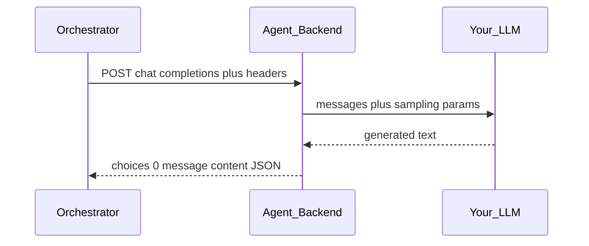
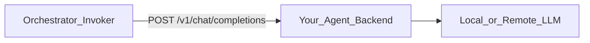

# DistLM — Agent Backend (remote agent endpoint)

An **agent backend** is **user-operated infrastructure**: a service that exposes a **chat-completions-style HTTP API**. The **orchestrator** calls it with a **persona**, **context**, **prompt**, and optional **data**; the agent returns **plain output text**. Nothing here requires the orchestrator to host your model.

**Companion doc (canonical I/O tables):** [orcplan.md](orcplan.md) §0 — orchestrator ingress/egress, invoker request/response, WebSocket envelope.

---

## 0. Outline

### What this is

A **user-run HTTP service** that looks like **OpenAI chat completions** to the DistLM orchestrator. You host the **model** (or proxy to one); the orchestrator does **not** host your weights.

### What it does

1. Accepts **`POST …/v1/chat/completions`** from the orchestrator’s sandboxed invoker.
2. Optionally **routes** traffic when one URL serves many slots (via **`X-DistLM-*`** headers).
3. Passes **`messages`** (persona + task text) to your **LLM** and returns **one completion string** in the standard JSON shape.

### How it works (flow)

### What you receive (inbound)

| Kind | Content |
|------|---------|
| **HTTP** | `POST {your_base}/v1/chat/completions` |
| **Headers** | `X-DistLM-Job-Id`, `X-DistLM-Slot-Id`, `X-DistLM-Round`; optional `Authorization` if the job registered a secret. |
| **JSON body** | OpenAI-style: `model`, `messages` (see §2.2), `max_tokens`, `temperature`, optional `user`. |
| **Inside `messages`** | **System**: persona + policy. **User**: `### Context`, `### Prompt`, optional `### Data` in that order. |

**Not sent on this API** (stays on the orchestrator / operator): job **`payout`**, settlement amounts, embeddings, kNN math, watchdog verdicts, WebSocket feeds. If you want the **model** to see incentive text, it must be something the orchestrator (or operator) places inside **`### Data`** or the visible Context/Prompt—not a separate money field in the MVP contract.

### What you return (outbound)

| Outcome | What to send |
|---------|----------------|
| **Success** | HTTP **2xx** + JSON with **`choices[0].message.content`** (UTF-8 plain text). Optional: `finish_reason`, `usage`. |
| **Failure** | HTTP **non-2xx** (prefer **4xx** vs **5xx** when meaningful) or exceed client timeout → orchestrator counts that slot/round as failed. |

### What you must uphold

- Honor **`system`** persona (§4). Treat **`### Context`** / **`### Data`** as **untrusted** text (§9).
- Bound **request size**, **latency**, and **output length** (§5). Never echo **secrets** in response bodies (§5).

The rest of this doc expands §0 into the full contract, routing, and hardening details.

---

## 1. Role in the system

- **One URL per slot** or **one fleet URL** for many slots (use **stable headers** from the orchestrator for routing—§3).
- The orchestrator applies **network sandboxing** (allowlist, timeouts); the agent should still **validate** and **bound** work (§5).

---

## 2. Contract: OpenAI-compatible chat completions

**Endpoint (MVP):** `POST {completion_base_url}/v1/chat/completions`  
Register `completion_base_url` exactly as the orchestrator will concatenate this path; see [orcplan.md](orcplan.md) §0.2.

### 2.1 Inputs (orchestrator → your server)

**HTTP headers** (orchestrator **always** sends on MVP invoker—do not require them for bare local tests, but **must** accept them for DistLM integration):

| Header | Meaning |
|--------|---------|
| `X-DistLM-Job-Id` | Job identifier. |
| `X-DistLM-Slot-Id` | Slot identifier (use for fleet routing / quotas). |
| `X-DistLM-Round` | Current round index (decimal string; 1-based recommended). |
| `Authorization` | Present iff the job registered a secret for this slot or job. |

**JSON body** — OpenAI chat completion shape:

| Field | Role |
|-------|------|
| `model` | string; may be cosmetic if your backend ignores it. |
| `messages` | See §2.2. |
| `max_tokens`, `temperature` | Set by orchestrator within sandbox caps. |
| `user` | Optional `"{job_id}:{slot_id}"` on orchestrator builds—logging only; **routing** should use `X-DistLM-*` headers. |

### 2.2 Message layout (stable)

- **`messages[0]` — `role: "system"`**  
  **Persona** text for this `(slot_id, round)` + short **policy** (e.g. plain UTF-8 text only, conciseness).

- **`messages[1]` — `role: "user"`**  
  One string containing **labeled sections** in this **order** (orchestrator guarantees the labels):

  1. **`### Context`** — conditioned background (may include kNN excerpts in later rounds).
  2. **`### Prompt`** — task instruction.
  3. **`### Data`** — optional; omit the whole section if empty.

### 2.3 Outputs (your server → orchestrator)

**Success (HTTP 2xx)** — JSON:

| Path | Role |
|------|------|
| `choices[0].message.content` | **Required.** Plain text (UTF-8). This is the only completion string the round engine consumes. |
| `choices[0].finish_reason` | Optional; may inform watchdog. |
| `usage` | Optional telemetry. |

**Failure** — HTTP **non-2xx** or timeout: orchestrator treats as failed completion for that slot/round. Prefer distinct **4xx** (bad request) vs **5xx** (transient) when your stack allows it.

**Storage on orchestrator side**: raw body hash + text for watchdog—your server should assume **content may be logged** for disputes (no secrets in completion text).

---

## 3. Slot identity and fleet URLs

- **Dedicated URL per slot**: simplest—headers still arrive for consistency.
- **Shared fleet URL**: route using **`X-DistLM-Job-Id`**, **`X-DistLM-Slot-Id`**, **`X-DistLM-Round`** ([orcplan.md](orcplan.md) §0.2). Do not rely on the model seeing slot ids unless you also duplicate them inside `### Data`; headers are the stable routing plane.

---

## 4. Personas

- The orchestrator selects **persona text** per `(slot_id, round)` from its catalog ([orcplan.md](orcplan.md) §3).
- **Agent obligation**: treat **`system`** as authoritative for behavior; do not strip persona unless your product explicitly overrides (that would break the simulation).

---

## 5. Sandbox expectations (agent-side)

What **your** backend should enforce (in addition to orchestrator allowlist):

- **Max request body size** (reject oversized context).
- **Timeout alignment**: respond before orchestrator’s client timeout or be marked failed.
- **Output length**: cap completion length to avoid watchdog pruning.
- **No exfiltration**: don’t embed user URLs into outbound requests unless that’s your explicit design.

**Secrets**: if registration uses **Bearer** or **HMAC**, the orchestrator attaches them **server-side**; **never** return these in response bodies.

---

## 6. Optional reference implementation (demo / dev)

A minimal **Python FastAPI** app:

- Forwards `messages` to **Ollama** `POST /v1/chat/completions` (OpenAI-compatible layer, model `qwen2.5:0.5b`).
- Maps response content back to `choices[0].message.content`.
- Enforces max tokens and logging redaction.

Use this when hackathon participants don’t have a hosted API; production agents replace this with their own stack.

---

## 7. Implementation order (agent backend)

1. **Contract tests**: given fixed JSON request bodies (including `X-DistLM-*` headers), return fixed text; assert OpenAI response shape.
2. **Reference server** (optional): Ollama bridge + env-configured `MODEL`.
3. **Hardening**: size limits, structured error responses (`4xx` vs `5xx`—orchestrator treats non-2xx as failure).

---

## 8. Add-ons (agent)

- **Queue + worker** behind the HTTP front for burst `agent_count`.
- **Per-job API keys** rotated at registration.
- **Streaming**: if orchestrator MVP expects non-streaming JSON only, disable streaming or buffer server-side.

---

## 9. Red flags (agent-centric)

| Risk | Mitigation |
|------|------------|
| **Prompt injection** in Context/Data | Treat user-supplied sections as untrusted; optional output filters for your environment. |
| **Overload** | Rate limit per API key; backpressure. |
| **Compliance** | You operate the model; log retention and PII are **your** policy. |
| **Ignoring persona** | Breaks swarm behavior—test with fixed system prompts. |

---

## 10. Relation to orchestrator

| System | Responsibility |
|--------|----------------|
| **Orchestrator** | Job API, embeddings, kNN rounds, watchdog, impact, payout, WebSockets—[orcplan.md](orcplan.md). |
| **Agent backend** | **Serving completions** under §2–3; mirror of [orcplan.md](orcplan.md) §0.2–0.3. |
