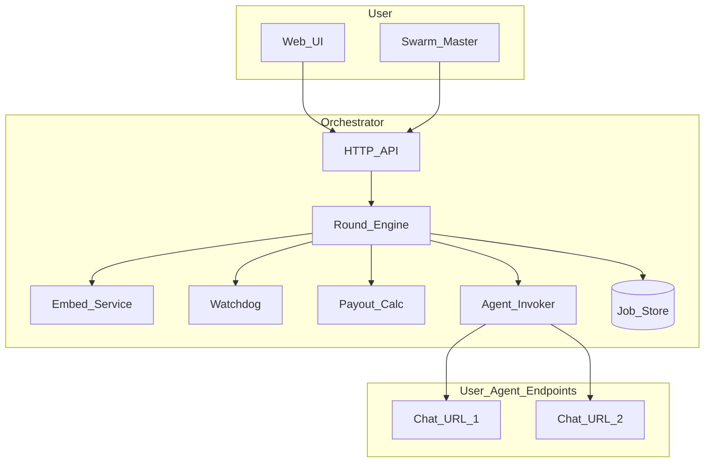

# DistLM — Orchestrator Backend

The **orchestrator** (coordinator service) owns **job lifecycle**, **embedding conditioning**, **round orchestration with kNN context dynamics**, **outbound calls** to user-registered chat URLs via a **sandboxed invoker**, **watchdog pruning**, **consensus/impact metrics**, **payout allocation** (numeric only), **real-time UI streams**, and **demo replay**.

**Companion doc:** remote agent HTTP contract and optional reference server—[agentplan.md](agentplan.md).

---

## 0. Inputs and outputs (stable contract)

This section is the **single cross-doc reference** for what crosses each boundary. Field names and semantics here match [agentplan.md](agentplan.md).

### 0.1 Operator → Orchestrator (HTTP ingress)

**`POST /jobs`** — **body (JSON, inputs)**

| Field | Type | Required | Description |
|-------|------|----------|-------------|
| `context` | string | yes | Task background; embedded with `prompt` for conditioning (§1). |
| `prompt` | string | yes | Task instruction. |
| `agent_count` | integer | yes | Concurrent agent slots (≥ 1). |
| `rounds` | integer | yes | Full collect → embed → context-update cycles (≥ 1). |
| `payout` | number | yes | Opaque numeric pool; orchestrator splits only (§6). |
| `embedding_model_version` | string | no | Version tag for reproducibility / audit. |

**`POST /jobs` — response (JSON, outputs)**

| Field | Type | Description |
|-------|------|-------------|
| `job_id` | string | Opaque job identifier for all subsequent routes. |

**`POST /jobs/{job_id}/agents`** — **body (JSON, inputs)**  
One registration payload per job after creation. Exact shape is either a **map** or a **list**; pick one in implementation and keep it stable:

- **Recommended (map)**: `{ "slots": { "<slot_id>": { "completion_base_url": "<url>" }, ... }, "auth"?: { ... } }`  
  - `completion_base_url`: base URL the invoker will call as `POST {completion_base_url}/v1/chat/completions` (no trailing path segment beyond what you register—trailing slash normalized once).
- **Optional `auth`**: per-slot or job-level secret **handles** (orchestrator stores server-side; never returned in public `GET /jobs`).

**`POST /jobs/{job_id}/agents` — response (JSON, outputs)**

| Field | Type | Description |
|-------|------|-------------|
| `ok` | boolean | Registration accepted. |
| `registered_slots` | string[] | Slot ids now bound (echo for confirmation). |

**`GET /jobs/{job_id}`** — **response (JSON, outputs)**  
Public job status (no raw agent secrets):

| Field | Type | Description |
|-------|------|-------------|
| `job_id` | string | |
| `status` | string | e.g. `pending`, `running`, `completed`, `failed`. |
| `agent_count`, `rounds`, `payout` | echo | From create; `payout` is number only. |
| `current_round` | integer \| null | Active or last completed round index. |
| `settlement_preview` | object | optional; numeric breakdown when job is terminal (§6). |

**`GET /jobs/{job_id}/operator`** — **response (JSON, outputs)**  
Swarm master only (**auth**). Includes per-slot, per-round: persona text, raw completion text, embedding id / metadata, prune status (`valid` \| `suspect` \| `pruned`), impact counters—see §4–§5. Exact nested schema lives with the job store implementation; semantically it is the **audit surface** for the round engine.

### 0.2 Orchestrator → Agent (invoker egress)

For each active slot each round, the invoker issues:

- **Method / URL**: `POST {completion_base_url}/v1/chat/completions`
- **Headers (stable, always sent on MVP invoker)**:

| Header | Value |
|--------|--------|
| `Content-Type` | `application/json` |
| `Authorization` | Present iff registration supplied a Bearer (or adapter-specific) secret for that slot or job. |
| `X-DistLM-Job-Id` | `job_id` |
| `X-DistLM-Slot-Id` | `slot_id` |
| `X-DistLM-Round` | decimal string of current round index (1-based recommended: `"1"` … `"R"`). |

- **Body (JSON, inputs)** — OpenAI-compatible **chat completion** request:

| Field | Description |
|-------|-------------|
| `model` | string; orchestrator default or job-configured cosmetic id (agents may ignore). |
| `messages` | Array of length ≥ 2 in order: one `role: "system"`, one `role: "user"` (see below). |
| `max_tokens`, `temperature` | Set within orchestrator sandbox caps. |
| `user` | Optional string `"{job_id}:{slot_id}"` for abuse/logging on compatible stacks; **not** a substitute for headers for routing. |

**`messages[0]` (`role: "system"`)** — **inputs to the model**

- Concatenation (or clearly delimited blocks) of: **persona** text for this `(slot_id, round)` from the persona catalog (§2) + short **policy** snippet (e.g. plain UTF-8 text only, conciseness).

**`messages[1]` (`role: "user"`)** — **inputs to the model**

- Single string body containing **labeled sections** in this **stable order** (orchestrator MUST preserve labels for parser stability on the agent side if needed):

  1. **`### Context`** — round-conditioned background (round 1: user `context` + metadata; later rounds: may include kNN neighbor excerpts, bounded length).
  2. **`### Prompt`** — user `prompt` (task instruction).
  3. **`### Data`** — optional; JSON string or short artifacts from prior rounds only if policy allows; omit section entirely if empty.

### 0.3 Agent → Orchestrator (invoker ingress)

**Success (HTTP 2xx)** — **response body (JSON, outputs)**

| Path | Type | Description |
|------|------|-------------|
| `choices[0].message.content` | string | **Completion text** (UTF-8 plain text). Only field the round engine requires for embedding and watchdog. |
| `choices[0].finish_reason` | string | optional; may inform watchdog. |
| `usage` | object | optional; telemetry. |

**Failure (HTTP non-2xx or timeout)** — **outputs to round engine**

- No reliable `content`: treat as **failed completion** for that slot/round (watchdog / retry policy as implemented).
- Optional JSON error body is logged **redacted** (no echo of inbound secrets).

### 0.4 Orchestrator → Operator (WebSocket egress)

**`WS /ws/jobs/{job_id}`** — server → client **message envelope (stable minimal fields)**

| Field | Description |
|-------|-------------|
| `type` | Event discriminator, e.g. `round_started`, `agent_line`, `edge`, `watchdog`, `job_done`. |
| `round` | integer when applicable. |
| `slot_id` | string when applicable. |
| `payload` | type-specific object (e.g. sampled text line, graph edge `{from,to,kind}`, prune reason). |

Full event catalog is implementation-defined; **consumers should ignore unknown `type` values** forward-compatibly.

---

## 1. User-facing job fields (orchestrator semantics)

Same as §0.1 **create job** body: **Context**, **Prompt**, **Agent count**, **Rounds**, **Payout** are the operator’s declarative inputs. **Create job** returns `job_id`. Each **slot** is bound to a **`completion_base_url`** via registration (§0.1).

---

## 2. Custom embedding space (“noise filter”)

- **Inputs**: Concatenate or structured-pack **context + prompt** (and optionally a job-level hash) and map through your **trained embedder** (same space used for all answer texts).
- **Purpose**: (1) **condition** the task representation, (2) **compare** agent outputs in a space you control (vs raw string overlap).
- **Implementation**: load a checkpoint in-process, or call an embed microservice; `embed(text) -> vector` with **version tag** on the job for reproducibility.
- **Hackathon honesty**: pluggable backend (e.g. sentence-transformers fallback) behind the same interface until your trained model ships.

---

## 3. Personas and registration (orchestrator side)

- **Persona catalog**: pregenerated personas (id, system text, style constraints) stored and versioned in the orchestrator.
- **Rotation**: `persona_index = f(slot_id, round, job_salt)` so re-entries get a **new persona** each time.
- **Slots**: `slot_id` per job; optional `external_participant_id` for accounting across jobs—payout policy is documented in §7.
- **Registration API**: accept `completion_base_url` per slot (or one URL shared by a fleet—see [agentplan.md](agentplan.md) §3).

The orchestrator **does not** run user LLMs; it **builds** OpenAI-compatible requests (§0.2) and **invokes** registered URLs.

---

## 4. Round engine (one round)

For each `round` in `1..R` for each **non-pruned** slot `i`:

1. **Build request** per §0.2: `persona_i`, `context_i` (round 1: see **First round**; later rounds: kNN-updated), **prompt**, optional **data**. Send via **invoker** to the slot’s URL.
2. **Collect** `text_i` from `choices[0].message.content` or timeout / non-2xx.
3. **Watchdog** (§5): quick checks before embedding; **suspect** / **prune**.

After all active slots finish for the round:

4. **Embed** each answer → `v_i` (same space as §2).
5. **Consensus viz**: persist `{round, slot_id, v_i, text_i}` for projection/UMAP/PCA.
6. **kNN context update** for the **next** round:
   - For each `i`, distances to all other `j`; **nearest** and **furthest** neighbors (excluding self).
   - Next `context_i`: new persona if required, **excerpts** from neighbor answers (bounded), optional trimmed **Context** + **Prompt** re-injection.
7. **WebSocket**: per-agent lines, sampled edges `(i → nearest)`, `(i → furthest)`.

**First round**: `context_i` = user **Context** + task embedding metadata (e.g. filtered embedding id) + persona; **no neighbors**—null or prompt-only baseline.

---

## 5. Watchdog (central)

**Goals**: prune bad outputs; expose full detail to **swarm master** (operator).

**Signals**: empty/short/duplicate; cosine match to refusal template embeddings; HTTP errors/latency; per-slot bad streaks.

**Actions**: **prune** slot (stop future rounds; recommend **skip** with payout forfeit); tag `valid | suspect | pruned`.

**Operator API** (`operator` role): per round—persona, raw text, embedding id, prune status, impact counters; aggregate consensus + payout preview.

---

## 6. Impact on consensus

Among **active** agents each round:

- For each ordered pair `(a,b)`, `a ≠ b`, determine whose answer embedding is **nearest** to `v_b` (ties: split credit) → contributes to **C_i**.
- Optionally count **furthest** relationships → **F_i** (with distance threshold to reduce noise).

`impact_i = w_c * C_i + w_f * F_i` (defaults e.g. `w_c=1`, `w_f=0.5`).

---

## 7. Payout (numeric)

- **P** = payout number; **N** = eligible agents at **job-end settlement** (recommended); **pruned forfeit** (recommended).
- `avg = P / N`; `floor_i = 0.75 * avg`; `pool_extra = P - sum_i floor_i`; `pay_i = floor_i + pool_extra * (impact_i / sum(impact))`; if `sum(impact)==0`, split `pool_extra` equally.
- **Rounding**: enforce `sum_i pay_i = P` (largest remainder or adjust last).
- Document **per-slot vs per-participant** payout when `external_participant_id` repeats.

---

## 8. Architecture (orchestrator)

- **WebSocket**: progress, embeddings metadata (or **2D projection** / cluster id—not full vectors if huge).
- **Optional internal demo worker**: only if users don’t supply URLs; same contract as [agentplan.md](agentplan.md).

---

## 9. HTTP surface (orchestrator) — summary

| Endpoint | Notes |
|----------|--------|
| `POST /jobs` | Inputs/outputs: §0.1. |
| `POST /jobs/{id}/agents` | Slot → `completion_base_url` (+ optional auth). §0.1. |
| `GET /jobs/{id}` | Status, per-round summary, settlement preview. §0.1. |
| `GET /jobs/{id}/operator` | Swarm master audit (**auth**). §0.1, §5. |
| `WS /ws/jobs/{id}` | Feed; §0.4. |

---

## 10. Implementation order (orchestrator)

1. Schemas + job store aligned with §0.1 field names.
2. Embed service (interface + fake vectors).
3. Invoker + mock agent HTTP server in tests (§0.2–0.3).
4. Two slots, two rounds (local echo URLs) → kNN context.
5. Watchdog + prune.
6. Impact + payout + rounding tests.
7. Multi-round + persona rotation.
8. WebSocket + optional 2D projection.
9. Demo JSONL replay.

---

## 11. Add-ons (orchestrator)

- HNSW / batch embed at scale.
- Cross-job reputation (orchestrator DB).
- Frozen audit export (vectors + texts).
- Payout CSV export.

---

## 12. Red flags (orchestrator-centric)

| Risk | Mitigation |
|------|------------|
| **SSRF** via registered URLs | Allowlist hosts, block metadata IPs, no `file://`, limit redirects; optional egress proxy. |
| **Prompt injection** (stored context) | Length limits; system vs user separation; optional tool-strip in adapter. |
| **Embedding claims** | Versioned model + eval artifact. |
| **Latency** | Bounded concurrency, per-round deadlines, async gather. |
| **Privacy** | Encrypt job data at rest; retention toggle. |

---

## 13. Deferred

- Real payment rails.
- Byzantine proofs—watchdog + impact suffice for MVP.

See [agentplan.md](agentplan.md) for **agent-side** risks and the mirrored **HTTP contract** (§0.2–0.3 here = agent doc §2–3).
